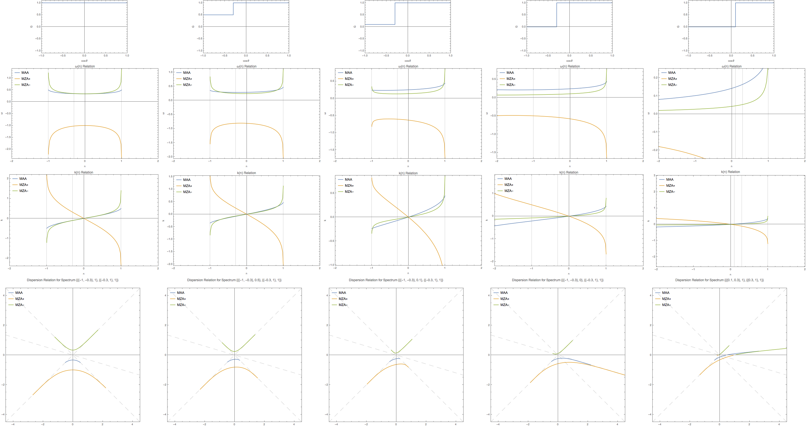
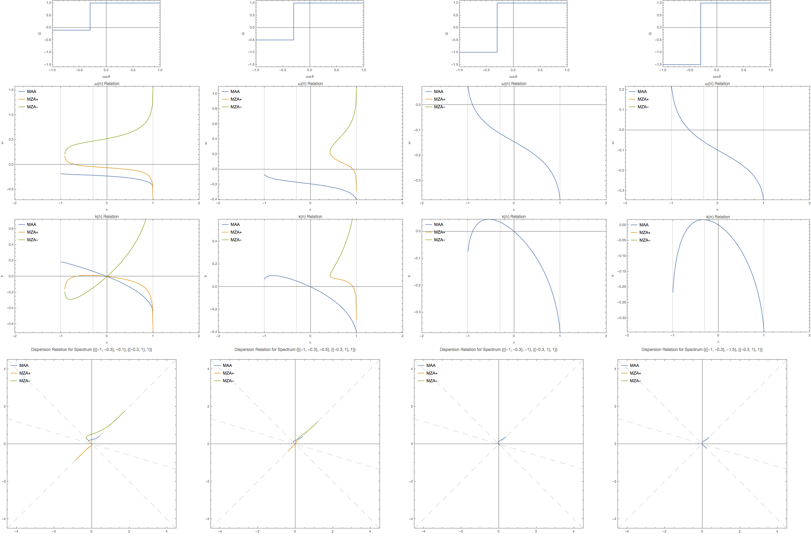

Dispersion Relation and Crossing
===================================

Box Spectrum
-----------------------

Since box spectrum is easier and faster to calculate, we'll explore the phenomena within box spectrum. For example, the spectrum notation

.. code-block:: Mathematica

   {{{-1, -0.3}, -0.2}, {{-0.3, 1}, 0.7}}

indicates tht the spectrum has a constant value -0.2 within :math:`\cos\theta \in [-1,-0.3]` and value 0.7 within :math:`\cos\theta \in [-0.3,1]`.

   No crossing

   With crossing

.. admonition:: Observations and Questions
   :class: warning

   1. Any 0 in spectrum make it possible go cross the singularity line.
