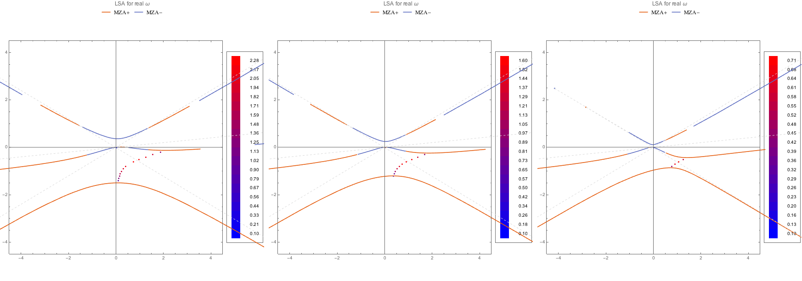
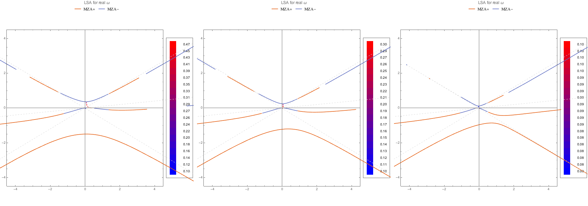
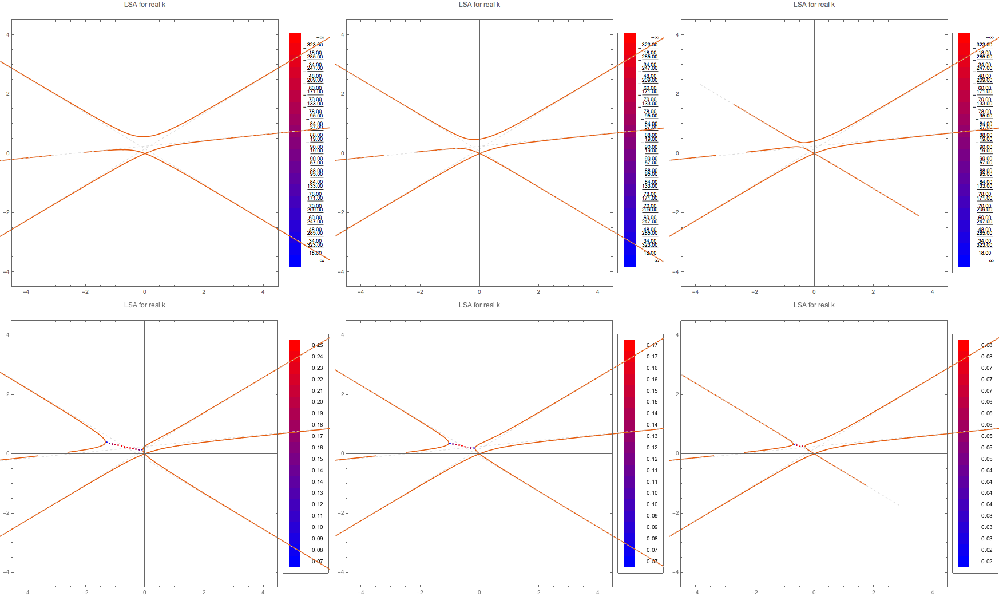

Dispersion Relation and Gap
===============================

Discrete Beams
-------------------

I define the following beams,

.. code-block:: Mathematica

   spectDBWC1 = {{1, -0.6}, {1, 0.1}, {1, 0.6}}
   spectDBWC2 = {{0.5, -0.6}, {1, 0.1}, {1, 0.6}}
   spectDBWC3 = {{0.1, -0.6}, {1, 0.1}, {1, 0.6}}

   spectDBC1 = {{-1, -0.6}, {1, 0.1}, {1, 0.6}}
   spectDBC2 = {{-0.5, -0.6}, {1, 0.1}, {1, 0.6}}
   spectDBC3 = {{-0.1, -0.6}, {1, 0.1}, {1, 0.6}}

The first thing is to really see that the instability regions are going through the gap in discrete beams case.

.. figure:: assets/dispersion-relation-gap/lsaMAAROPltDB-WC1-to-WC3.png
   :align: center

   MAA solutions for spectra WC1, WC2, WC3. The instability regions go through the gap.

.. figure:: assets/dispersion-relation-gap/lsaMAAROPltDB-C1-to-C3.png
   :align: center

   MAA solutions for spectra C1, C2, C3. For real :math:`\omega`, no complex k is found.

The MZA+ solution can also be found.

   MZA+ solution for WC spectra.

.. figure:: assets/dispersion-relation-gap/lsaMZApROPltDB-C1-to-C3.png
   :align: center

   MZA+ solution for C spectra. As like before, no instability in k is found.

The MZA- solutions:

   MZA- solution for WC spectra.

.. figure:: assets/dispersion-relation-gap/lsaMZAmROPltDB-C1-to-C3.png
   :align: center

   MZA- solution for C spectra.

So the C spectra have no instabilities in k. I should calculate the instabilities in :math:`\omega` for real k.

   MAA solution for real k finding complex :math:`\omega`.

.. figure:: assets/dispersion-relation-gap/lsaMZApRKPltDB-WC1-to-WC3-and-C1-to-C3.png
   :align: center

   MZA+ solution for real k finding complex :math:`\omega`.

.. figure:: assets/dispersion-relation-gap/lsaMZAmRKPltDB-WC1-to-WC3-and-C1-to-C3.png
   :align: center

   MZA- solution for real k finding complex :math:`\omega`.

Two Beams
-------------------------------------

For two beams, the equation :math:`f(\omega,k)=0` is quadratic in both :math:`\omega` and :math:`k`, thus two solutions everywhere even for complex solutions.

.. admonition:: Infinities at Emission Angle
   :class: note

   It has been a very weird thing that the MZA DR lines can cross the forbidden lines defined by the emission angle. To illustrate this problem, we think of a two beams model, with spectrum :math:`\{\{g_1,u_1\},\{g_2,u_2\}\}`.

   The equation for DR has terms of the form

   .. math::
      \frac{1}{1-n u_i},

   which indicates that this can lead to infinity when :math:`n=1/u_i`, unless the numerator is 0. For MAA solution, the numerator indeed becomes 0. But for MZA solution it is not that obvious.

   However, we can prove that one of the MZA solutions is still finite as :math:`n=1/u_i`.

   The MZA solution is

   .. math::
      \omega(n) = -\frac{1}{4} \left(  I_0 - I_2 \pm \sqrt{  (I_0+I_2 - 2I_1)(I_0+I_2 + 2I_1) } \right),

   where

   .. math::
      I_m = \sum g_i \frac{ u_i^m }{1 - m u_i}.

   We are interested in wether the term

   .. math::
      I_0 - I_2 \pm \sqrt{  (I_0+I_2 - 2I_1)(I_0+I_2 + 2I_1) }

   will become finite at :math:`n=1/u_i`. We plug in the expressions for :math:`I_m`.

   .. math::
      &I_0 - I_2 \pm \sqrt{  (I_0+I_2 - 2I_1)(I_0+I_2 + 2I_1) } \\
      =&\sum_i \frac{ g_i(1-u_i^2) }{1-n u_i} \pm \sqrt{ \left( \sum_i \frac{ g_i(u_i-1)^2 }{ 1- nu_i } \right) \left( \sum_i \frac{ g_i(u_i+1)^2 }{ 1- nu_i } \right) } \\
      =& \frac{ g_1 (1-u_1^2)(1-n u_2) + g_2(1-u_2^2)(1-n u_1) }{ (1-n u_1)(1-n u_2) } \pm \sqrt{  \frac{ [ g_1 (1-u_1)^2 (1-n u_2) + g_2 (1-u_2)^2 (1-n u_1) ][ g_1 (1+u_1)^2 (1-n u_2) + g_2 (1+u_2)^2 (1-n u_1) ] }{ (1-n u_1)^2(1-n u_2)^2 } }.

   We take the limit :math:`n\to 1/u_i`.

   .. math::
      &I_0 - I_2 \pm \sqrt{  (I_0+I_2 - 2I_1)(I_0+I_2 + 2I_1) } \\
      =& \frac{ g_1(1-u_1^2) }{ 1- n u_1 } \pm  \left\lvert \frac{ g_1(1-u_1^2)  }{  1 - n u_1  } \right\rvert.

   One of the solutions, + or -, will be 0, depending on spectrum and also which side we are approaching the limit.

   Suppose we have :math:`g_1>0` and :math:`n\to 1/u_1 +` (:math:`1-n u_1<0`).

   .. math::
      \omega(n) = \frac{ g_1(1-u_1^2) }{ 1- n u_1 } \pm  \left(  - \frac{ g_1(1-u_1^2)  }{  1 - n u_1  }  \right),

   so that the MZA+ solution is 0.

Solutions
-----------------------------------

It seems that gap and instability are not really related all the time. For discrete beams, the number of solutions is the key to instabilities.

It shows that spectrum :math:`DBC1` has only MZA+ instabilities on the left side of the axis for real k. We need to prove that no solutions are found on the left side of the axis. Similarly for MZA- solutions but on different sides.

References and Notes
-----------------------------
