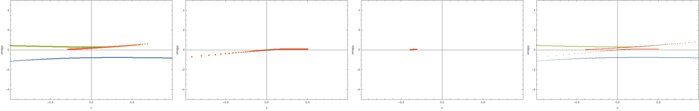
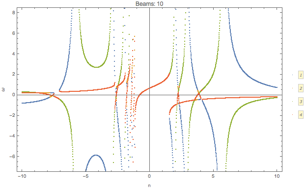

Dispersion Relation
================================

Reference to notes:

Izaguirre, I., Raffelt, G., & Tamborra, I. (2016). Fast Pairwise Conversion of Supernova Neutrinos: Dispersion-Relation Approach, 21101(January), 1–6. https://doi.org/10.1103/PhysRevLett.118.021101

Polarization Tensor
--------------------------

In Raffelt's paper, they parametrize :math:`k^\mu(n)` then the polarization tensor is decomposed into two parts,

.. math::
   \eta^{\mu\nu}

and

.. math::
   \frac{1}{\omega}N^{\mu\nu},

where

.. math::
   N^{\mu\nu} = \int d\Gamma G_{\mathbf v} \frac{v^\mu v^\nu}{ 1-n \hat{\mathbf k} \cdot \mathbf v },

with :math:`k^\mu=(\omega,\mathbf k)`.

.. admonition:: Note to self
   :class: warning

   The actual wave vector that determines the instability is :math:`K^\mu` which is related to :math:`k^\mu`,

   .. math::
      k^\mu= K^\mu - (\Lambda^\mu + \Phi^\mu).

   Since :math:`\Lambda^\mu` and :math:`\Phi^\mu` are real, imaginary part of :math:`\omega` (:math:`\mathbf k`) equal imaginary part of :math:`\Omega` (:math:`\mathbf K`). Thus we only discuss the dispersion relation of :math:`k^\mu`.

   Density matrix is written as

   .. math::
      \rho = \begin{pmatrix}
      1 & \epsilon \\
      \epsilon^* & -1
      \end{pmatrix}.

   The perturbation :math:`\epsilon` is assumed to have the form

   .. math::
      \epsilon = Q(\Omega, \mathbf K) e^{ -i( \Omega t - \mathbf K \cdot \mathbf x ) }.

   This assumption indicates that even though we find instabilities, a proper initial condition/boundary condition is required to stimulate this instability.

The polarization tensor is in fact

.. math::
   \Pi^{\mu\nu} = \eta - \frac{1}{\omega}N^{\mu\nu}.

The equation of motion becomes

.. math::
   v_\mu \Pi^{\mu\nu} a_\nu =0 ,

where

.. math::
   a_\nu = - \int d\Gamma v_\nu G_{\mathbf v} Q_{\mathbf v}.

Since :math:`v_\mu` is (component) of a null dual vector, we require :math:`\Pi^{\mu\nu} a_\nu` to be (component) proportional to :math:`v^\mu`. Since we have a lot of directions, different :math:`v^\mu` are independent of each other. So we require :math:`\Pi^{\mu\nu} a_\nu=0`.

Then we need to find the solution to

.. math::
   \mathrm{Det}(\Pi^{\mu\nu})=0,

which is simplified to

.. math::
   \mathrm{Det}(\omega \eta^{\mu\nu} - N^{\mu\nu}) = 0.

We can multiply a minus on both sides. Note that

.. math::
   -\mathrm{Det}(\omega \eta^{\mu\nu} - N^{\mu\nu})

is the determinant of a matrix

.. math::
   \omega I - N'^{\mu\nu},

where :math:`N'` is a matrix with the first row of :math:`N` multiplied by a minus sign.

Equivalently, we only need to find the eigenvalues of :math:`N'`.

Dispersion Relation
---------------------

Raffelt et al proposed that can now solve the dispersion relation by finding the value of :math:`k^\mu(n)` for each n. We make the plot :math:`\omega` vs :math:`\mathbf k`.

Here is an example that I calculated.

The axial symmetric system can be calculated easily using this method. The paper gave an example of two polar angle beams with axial symmetry.

.. figure:: assets/dispersion-relation/listpltOmegan1.png
   :align: center

   :math:`\omega(n)` for :math:`G=0.5 \delta(\cos\theta- 0.8) + 0.5 \delta(\cos\theta+0.2)`.

   Dispersion relation.

We can check what happens for multibeams. I can plot the dispersion relation for similar configuration but with different number of beams.

.. figure:: assets/dispersion-relation/listanimi1.png
   :align: center

   Animition of dispersion relation.

   .. code:: text

      dataPltNBeamsPlt[Join[Table[1/beams, {n, 1, beams/2}],
      Table[-1/beams, {n, 1, beams/2}]],
      Table[Pi/3 + n Pi/2/(beams - 1), {n, 0, beams - 1}], {-10, 10}, 0.049, {{-10, 10}, {-10, 10}}]

I plot the :math:`\omega(n)` relation for different number of beams

.. image:: assets/dispersion-relation/listpltOmegan12List-2.png
   :width: 49%

.. image:: assets/dispersion-relation/listpltOmegan12List-4.png
   :width: 49%

.. image:: assets/dispersion-relation/listpltOmegan12List-8.png
   :width: 49%

Similar to the previous example, confining the range of :math:`n` leads to only a partial patch of the dispersion relation.

.. figure:: assets/dispersion-relation/pltDiffBeamsConfined-n-in--1-to-1-beams-10.png
   :align: center

   .. code::

      pltDiffBeamsConfined[beams_] := dataPltNBeamsPlt[
      Join[Table[1/beams, {n, 1, beams/2}],
      Table[-1/beams, {n, 1, beams/2}]],
      Table[Pi/3 + n Pi/2/(beams - 1), {n, 0, beams - 1}], {-1, 1},
      0.049, {{-10, 10}, {-10, 10}}]

.. admonition:: This should be the continuous limit?
   :class: warning

   As a comparison, we can plot the dispersion relation in a larger range of n for 10 beams.

   .. figure:: assets/dispersion-relation/listpltOmegan12List-10.png
      :align: center

      10 beams.

   On the other hand, we can calculate the continuous limit for the same angle range.

   .. figure:: assets/dispersion-relation/compare-continuous-and-10-beams-within-n-range--1-to-1.png
      :align: center

      Dispersion relation for 10 beams (:math:`n\in [-1,1]`), and continuous limit.

   MEH

Analyze the Symmetries in Dispersion Relation
------------------------------------------------------------------

Four velocity can be expressed in terms of spherical harmonics.

.. math::
   v^\mu = \sqrt{\pi}\begin{pmatrix} 2 & \sqrt{2/3} (Y_1^{-1} - Y_1^1) & i \sqrt{2/3} (Y_1^{-1} + Y_1^1) & 2\sqrt{1/3} Y_1^0 \end{pmatrix}.
