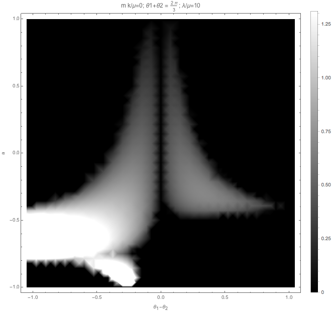

Fast Modes
====================

.. admonition:: Four Beams Model
   :class: hint

   There are many things to consider for the four beams line model.

   1. Different emission angle for neutrinos and antineutrinos;
   2. Different density for neutrinos and antineutrinos;
   3. Left and right difference.

Is the system unstable even for :math:`\omega_v=0` and :math:`\lambda=0`?

.. figure:: assets/fast-mode-alpha-0.8.png
   :align: center

   The maximum imaginary part in linear stability analysis. These calculations are for fix :math:`k_m/\hat E=1`, where :math:`\hat E` is the energy scale used to scale all the quantities.

   .. math::
      \omega_v =& 0\\
      \lambda =& 0\\
      \alpha = & 0.8.

   The grid of figure are arranged according to the following values of :math:`\{\theta_1,\theta_2\}`.

   .. math::
      \begin{array}{cccc}
      \left\{\frac{\pi }{6},\frac{\pi }{6}\right\} & \left\{\frac{\pi }{6},\frac{2 \pi }{9}\right\} & \left\{\frac{\pi }{6},\frac{5 \pi }{18}\right\} & \left\{\frac{\pi }{6},\frac{\pi }{3}\right\} \\
      \left\{\frac{2 \pi }{9},\frac{\pi }{6}\right\} & \left\{\frac{2 \pi }{9},\frac{2 \pi }{9}\right\} & \left\{\frac{2 \pi }{9},\frac{5 \pi }{18}\right\} & \left\{\frac{2 \pi }{9},\frac{\pi }{3}\right\} \\
      \left\{\frac{5 \pi }{18},\frac{\pi }{6}\right\} & \left\{\frac{5 \pi }{18},\frac{2 \pi }{9}\right\} & \left\{\frac{5 \pi }{18},\frac{5 \pi }{18}\right\} & \left\{\frac{5 \pi }{18},\frac{\pi }{3}\right\} \\
      \left\{\frac{\pi }{3},\frac{\pi }{6}\right\} & \left\{\frac{\pi }{3},\frac{2 \pi }{9}\right\} & \left\{\frac{\pi }{3},\frac{5 \pi }{18}\right\} & \left\{\frac{\pi }{3},\frac{\pi }{3}\right\} \\
      \end{array}

.. figure:: assets/fast-mode-alpha-1.2.png
   :align: center

   The maximum imaginary part in linear stability analysis. These calculations are for fix :math:`k_m/\hat E=1`, where :math:`\hat E` is the energy scale used to scale all the quantities.

   .. math::
      \omega_v =& 0\\
      \lambda =& 0\\
      \alpha = & 1.2.

   The grid of figure are arranged according to the following values of :math:`\{\theta_1,\theta_2\}`.

   .. math::
      \begin{array}{cccc}
      \left\{\frac{\pi }{6},\frac{\pi }{6}\right\} & \left\{\frac{\pi }{6},\frac{2 \pi }{9}\right\} & \left\{\frac{\pi }{6},\frac{5 \pi }{18}\right\} & \left\{\frac{\pi }{6},\frac{\pi }{3}\right\} \\
      \left\{\frac{2 \pi }{9},\frac{\pi }{6}\right\} & \left\{\frac{2 \pi }{9},\frac{2 \pi }{9}\right\} & \left\{\frac{2 \pi }{9},\frac{5 \pi }{18}\right\} & \left\{\frac{2 \pi }{9},\frac{\pi }{3}\right\} \\
      \left\{\frac{5 \pi }{18},\frac{\pi }{6}\right\} & \left\{\frac{5 \pi }{18},\frac{2 \pi }{9}\right\} & \left\{\frac{5 \pi }{18},\frac{5 \pi }{18}\right\} & \left\{\frac{5 \pi }{18},\frac{\pi }{3}\right\} \\
      \left\{\frac{\pi }{3},\frac{\pi }{6}\right\} & \left\{\frac{\pi }{3},\frac{2 \pi }{9}\right\} & \left\{\frac{\pi }{3},\frac{5 \pi }{18}\right\} & \left\{\frac{\pi }{3},\frac{\pi }{3}\right\} \\
      \end{array}

When we have symmetric geometry, the instability region is gone. Such a result is exactly what we expect. However, different

.. figure:: assets/fast-modes-fast-mode-no-matter-asymmetric-alpha-0.8.png
   :align: center

   Linear stability analysis for

   .. math::
      \omega_v =& 0\\
      \lambda =& 0\\
      \alpha = & 0.8 \\
      \theta_L =& 2\pi/9 \\
      \theta_R =& \pi/6.

Regions of Instability
----------------------------------

For convinience, we define some quantities for four beam case.

1. We define the a parameter :math:`\alpha=(1-a)/(1+a)` so that :math:`\alpha \in [0,\infty]` is mapped onto :math:`a\in [-1,1]`.
2. The summation of the two angles :math:`\Sigma\theta=\theta_1+\theta_2` and the difference between two angles :math:`\Delta\theta=\theta_1-\theta_2`, where :math:`\theta_1` is for neutrino beams.
3. Every quantity is in unit of :math:`\mu`.

First we check the result without matter, without vacuum frequency, and :math:`\Sigma\theta=2\pi/3`.

.. figure:: assets/plt2-sigmatheta-2Pi-divided-by-3-mk-divided-by-mu-0-lambda-divided-by-mu-0.png
   :align: center

   No matter, no vacuum frequency

We can also check the matter effect.

.. figure:: assets/plt2-sigmatheta-2Pi-divided-by-3-mk-divided-by-mu-0-lambda-divided-by-mu-1.png
   :align: center

   With matter, no vacuum frequency.

   With matter, no vacuum frequency.

.. figure:: assets/plt2-sigmatheta-2Pi-divided-by-3-mk-divided-by-mu-0-lambda-divided-by-mu-100.png
   :align: center

   With matter, no vacuum frequency.

Then we check the result without matter, without vacuum frequency, and :math:`\Sigma\theta=2\pi/3`, and :math:`\frac{m k}{\mu}=0.1`.

   No matter, no vacuum frequency.

The effect of :math:`m k/\mu` is also similar to matter effect.

.. figure:: assets/plt2-sigmatheta-2Pi-divided-by-3-mk-divided-by-mu-1-lambda-divided-by-mu-0.png
   :align: center

   Higher order Fourier modes, without matter, no vacuum frequency.

.. figure:: assets/plt2-sigmatheta-2Pi-divided-by-3-mk-divided-by-mu-10-lambda-divided-by-mu-0.png
   :align: center

   Higher order Fourier modes, without matter, no vacuum frequency.

Matter + Fourier modes also has suppression

.. figure:: assets/plt2-sigmatheta-2Pi-divided-by-3-mk-divided-by-mu-10-lambda-divided-by-mu-100.png
   :align: center

   Higher order Fourier modes, with matter, no vacuum frequency.

   Higher order Fourier modes, with matter, no vacuum frequency.
