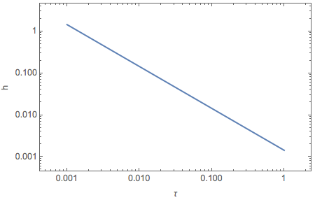

Gravitational Waves
==============================

As an estimation, the power of gravitation waves drop as :math:`1/r^2`. Thus the strain drops as :math:`1/r`.

For compact binary coalescence, the circular polarized wave at distance r is [Riles2013]_

.. math::
   h(t) =  \frac{1}{r} \left( \frac{5 G^5 M^5}{2 c^{11}} \right)^{1/4} \frac{1}{(t_{\mathrm{coal}} -t)^{1/4}},

which shows that the frequency diverges at :math:`t_{\mathrm{coal}}`.

In the astrophysicists' form, we have [Riles2013]_

.. math::
   h(\tau) = (1.7\times 10^{-23}) \left( \frac{15\mathrm{Mpc}}{r} \right) \left( \frac{1 \text{ day} }{\tau} \right)^{1/4} \left( \frac{M}{1.4M_{\odot}}\right)^{5/4}.

As an estimation, we can show that at :math:`r=1000 km` from the source,

.. math::
   h(\tau) \sim 10^{-6}\left( \frac{1 \text{ day} }{\tau} \right)^{1/4} \left( \frac{M}{1.4M_{\odot}}\right)^{5/4}.

As an example, we plot the evolution as a function of :math:`\tau` for 1.4 solar mass binaries.

   Binary mergers. In the beginning, gravitational waves are very strong.

.. admonition:: Strong Field
   :class: warning

   However, the problem is, for stong waves, this estimation fails. I need to find a paper that numerically calculates the strain for strong fields.

   **And I haven't found the right paper.**

The size of the disk of neutron star mergers are of the order :math:`10 km` [Foucart2012]_.

References and Notes
-----------------------

.. [Riles2013] K. Riles, `Gravitational waves: Sources, detectors and searches <http://dx.doi.org/10.1016/j.ppnp.2012.08.001>`_, Progress in Particle and Nuclear Physics, Volume 68, January 2013, Pages 1-54, ISSN 0146-6410.
.. [Foucart2012] Francois Foucart, `Black-hole–neutron-star mergers: Disk mass predictions <http://journals.aps.org/prd/abstract/10.1103/PhysRevD.86.124007>`_, Phys. Rev. D 86, December 2012.

Kip Thorne wrote a review paper about gravitational waves: `The Generation of Gravitational Waves: A Review of Computational Tecniques <https://www.its.caltech.edu/~kip/scripts/PubScans/II-68.pdf>`_.

A paper about modern techniques: `Extracting Physics from Gravitational Waves <http://www.nikhef.nl/pub/services/biblio/theses_pdf/thesis_T_G_F_Li.pdf>`_.
