2017-04 Group Meeting
========================

2017-04-13
---------------------

1. Show the new dispersion relations as well as the :math:`\omega(n)` plots.
2. Crossing change the number of solutions for different n.
3. Ask about how to identify the plus and minus modes before the calculation in the 2013 paper: Duan, H. (2013). Flavor oscillation modes in dense neutrino media. Physical Review D - Particles, Fields, Gravitation and Cosmology, 88(12), 1–7.

2017-04-19
---------------

1. The unstable points

Some Discussion on Scaling
~~~~~~~~~~~~~~~~~~~~~~~~~~~~~~

.. admonition:: Code
   :class: warning

   The corresponding Mathematica code is:

   codebase.git/mma/linear-stability/growth-in-fourier-modes.nb

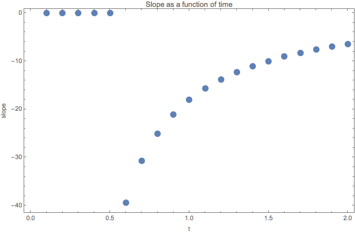

   Slope as a function of time. I tried log(-x) plot and it shows that -x decreases faster than exponential.

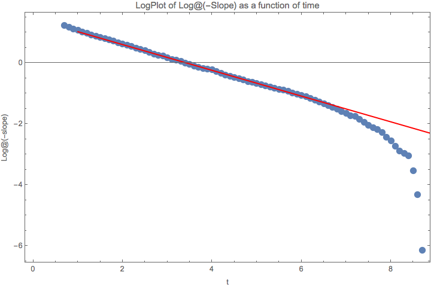

   In the beginning -x is decreasing as exp(exp(-k x + b)). But it than will be faster than this expression.
   The caveat is that the calculation of slope is not that accurate when it approaches 0. So we actually should truncate it. As being said, it might be a good idea to treat it as exp(exp(-k x + b)). The red line is :math:`1.48988 - 0.435439 x`.

This means that the time evolution of slope is quite complicated. But we should compare the slope at the same time for different parameters. For each time snapshot we should be able to guess the function of parameters that describes the slope.

As a very preliminary result, scale as I defined, changes how fast the perturbation is propagated into higher moments. So does the off diagonal element.

meh

The eigenvalues of this pseudo Hamiltonian

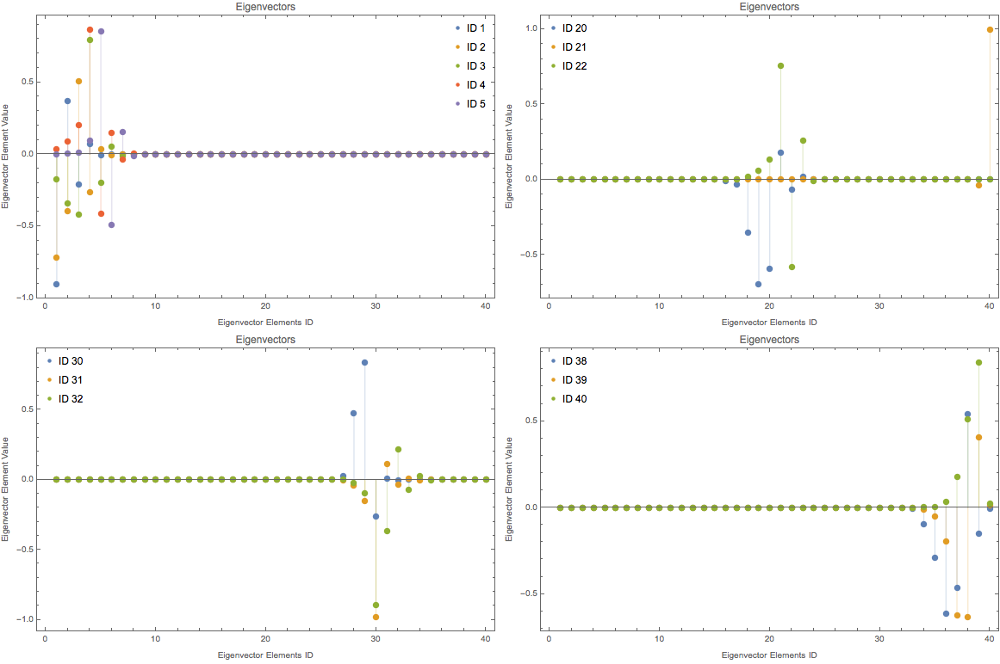

   Eigenvector components for different eigenvectors of this pseudo Hamiltonian. For mat[dim,1,1,1]

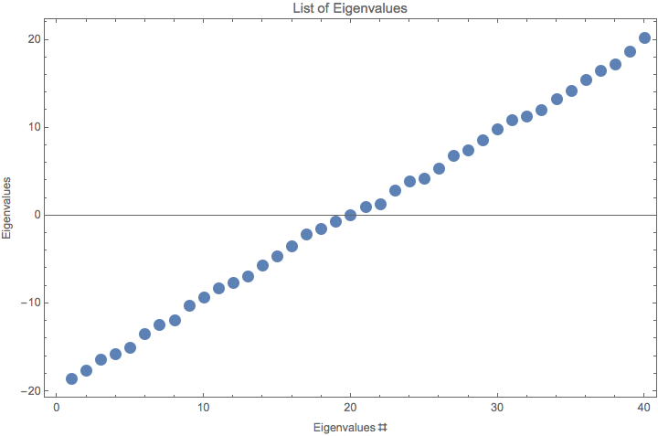

   Eigenvalues of this pseudo Hamiltonian. For mat[dim,1,1,1]

The key is actually the eigenvectors. If we assume each of the modes are plane waves, the eigenvalues are the ones that determines how fast the grow is while the eigenvectors tells us which element will grow. As I increase the scale, the eigenvectors seems to be more clean, i.e., fewer but hierarchial excited elements.

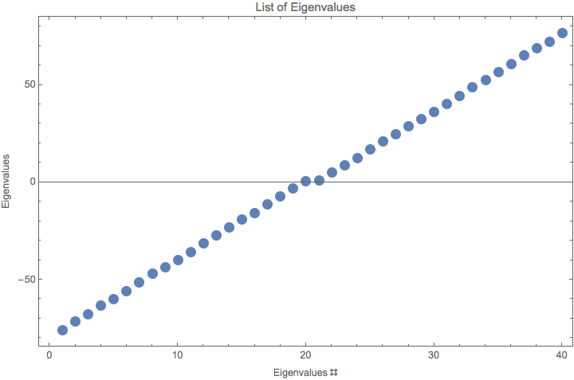

   Eigenvalues for mat[dim,4,1,1]. Notice that for the 20th and 21st eigenvalues are close to 0.

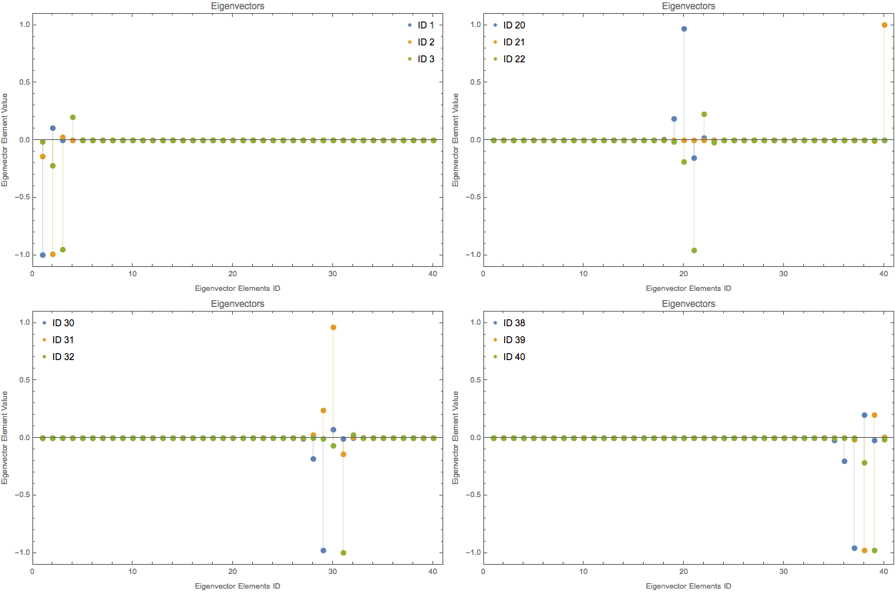

   Eigenvector components for different eigenvectors of this pseudo Hamiltonian. For mat[dim,4,1,1].

Decreasing the off diagonal elements have similar effect on eigenvectors which explains the similar structure of fourier modes for different off diagonal elements. However, they should have different growth rate as a function of time.

More explicitly, we plot out the logplot of eigenvector elements and we will see the exponential behavior.

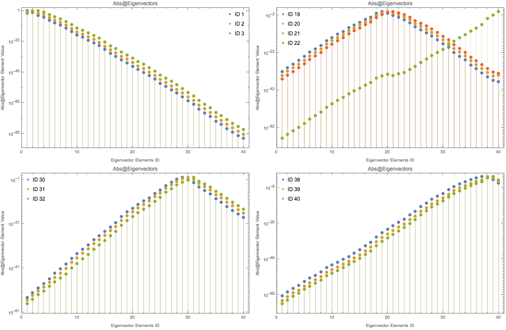

   LogPlot of Abs@eigenvecotors. For mat[dim,4,1,1].

Just for reference, the positive values of eigenvectors also have this exp behavior.

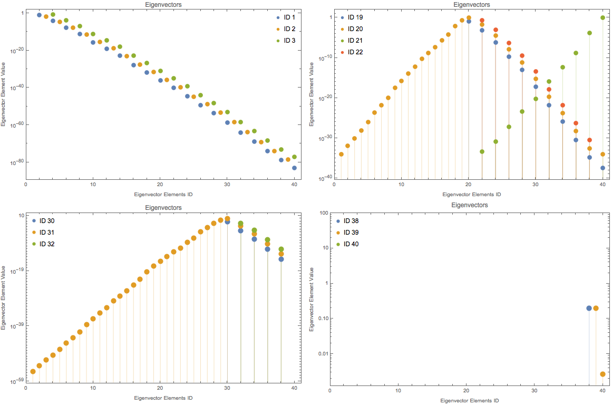

   LogPlot of positive elements of eigenvecotors. For mat[dim,4,1,1].

Do all the eigenvectors have the same slope?

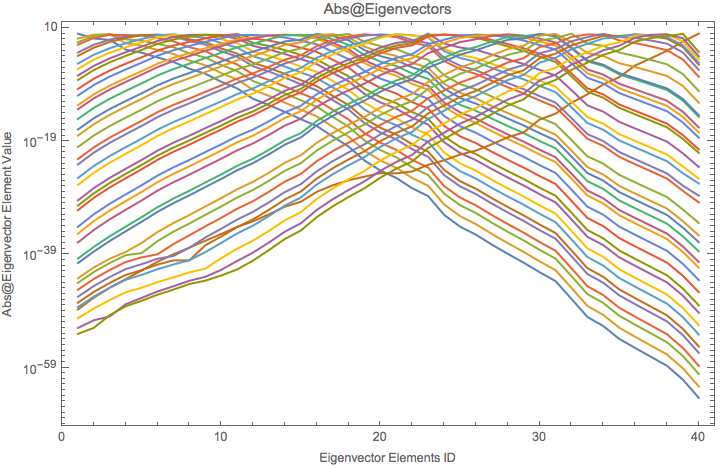

   All 40 eigenvectors for mat[dim,1,1,1]. Kind of same absolute values of slope.

Qualitatively we can see why the exponantial behavior in Fourier modes through the eigenvectors.

To guess an expression for it, I need to compare different scales.

As reference, we plot mat[dim,1,1,1].

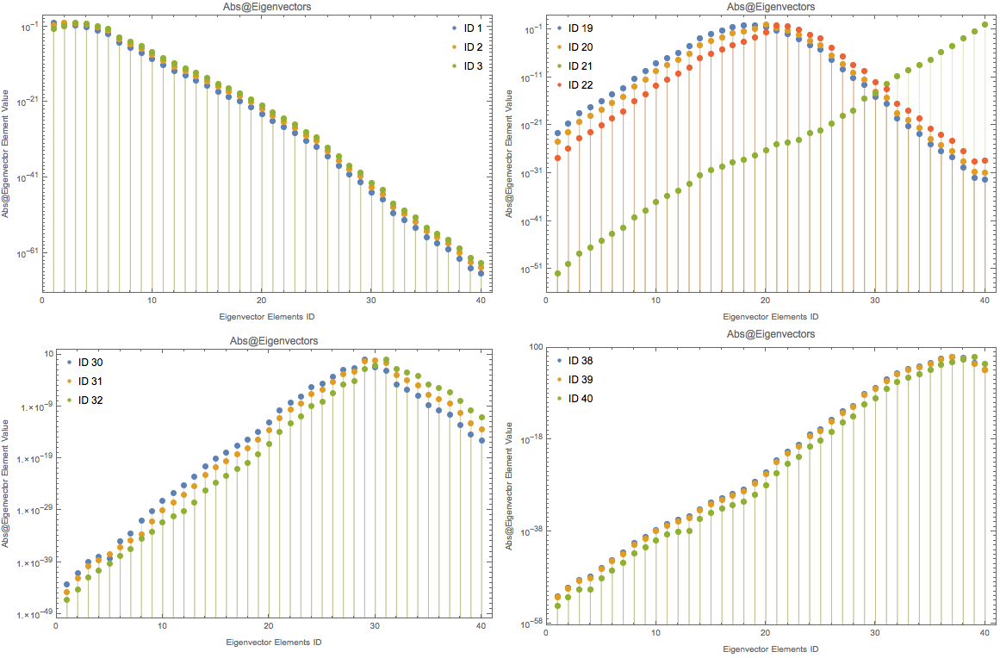

   LogPlot of Abs@eigenvecotors. For mat[dim,1,1,1].

Here is a plot that shows the slope of :math:`\text{Log@Abs@Eigenvalues}\sim \text{Eigenvalue Element ID}`.

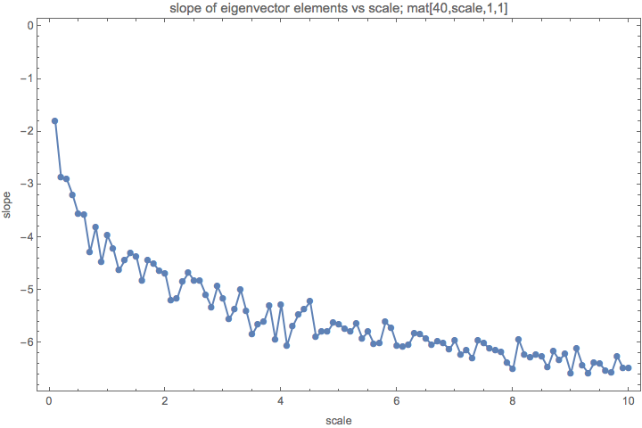

   Slope of eigenvector elements for different scales.
