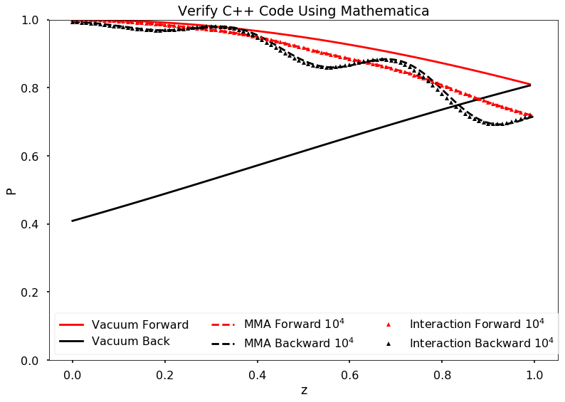

Halo Effect - Finite Difference
=================================

Models
------------------------

Toy Model
~~~~~~~~~~~~~~~~~

The toy model we use is neutrino-only, right forward beam and reflection.

For single angle neutrino-only emission, this model can also work for the tilted emission simply by rescale the neutrino self-interaction by :math:`\cos\alpha` where :math:`\alpha` the angle of forward and backward beams.

.. admonition:: Some Seasoning
   :class: note

   - [ ] Added in anti-neutrinos to the beams
   - [ ] Neutrino and anti-neutrino beams are in different directions

Model with Collective Oscillations
~~~~~~~~~~~~~~~~~~~~~~~~~~~~~~~~~~~~~~

Introduce multiangles and left-right asymmetries to the system.

Numerical Methods
-----------------------------------

Single Neutrino Forward then Backward
~~~~~~~~~~~~~~~~~~~~~~~~~~~~~~~~~~~~~~~~~~~~~~~~~~~~~~

.. admonition:: Algrimth
   :class: note

   1. Calculate forward beam using 0 backward beam;
   2. Calculate backward beam using forward beam calculated in 1;
   3. Calculate forward beam using backward beam calculated in 2;
   4. Repeat.

Single Neutrino Simultaneous
~~~~~~~~~~~~~~~~~~~~~~~~~~~~~~~~~

.. admonition:: Algrimth
   :class: note

   1. Calculate forward beam using 0 backward beam;
   2. Calculate backward beam and forward beam together using all current counter beams;
   3. Repeat.

.. admonition:: Computation Time
   :class: toggle

   **2017-09-13:**

   The export of my test code:

   .. code-block:: txt

      PROGRAM START
      Halo Problem Forward and Backward:
      Total number of iterations: 100
      Size of rhos: 1000
      Range: 1.000000
      Step size: 0.001000
      Save Steps: 2
      Total clock time: 0.070386
      Clock time for 1000 iterations: 0.70409
      PROGRAM END

   Some estimations:

   1. (1e5 steps in z) times (10000) steps requires (10000 times 7e-4 times 100 = 700) seconds;
   2. (1e6 steps in z) times (10000) steps requires (10000 times 7e-4 times 1000 = 7000 ) seconds, i.e., 117 minutes;
   3. (1e7 steps in z) times (10000) steps requires (10000 times 7e-4 times 10000 = 70000 ) seconds, i.e., 1e3 minutes.

   **2017-09-14:** I changed the Hamiltonian functions and solvers.

   .. code-block:: txt

      PROGRAM START
      Halo Problem Forward and Backward:
      Total number of iterations: 100
      Size of rhos: 1000
      Range: 1.000000
      Step size: 0.001000
      Save Steps: 2
      Total clock time: 0.018305
      Clock time for 1000 iterations: 0.18335
      PROGRAM END

   3.5 times faster!

The result shows that

.. raw:: html

   <video width="100%" controls>
   <source src="../_static/assets/halo/halo-effect-finite-difference/halo_sim_osc_20000_100000_1.000000_0.000010.csv.mp4" type="video/mp4">
   Your browser does not support HTML5 video.
   </video>
   
For 20000 total iteractions. Calculation is within range 0 to 1 with step size 1e-5. A total of 100 steps are exported. So each step indicates iteration of 200 times.

.. admonition:: GIF: Step size :math:`10^{-5}`
   :class: toggle

   .. figure:: assets/halo-effect-finite-difference/halo_sim_osc_20000_100000_1.000000_0.000010.csv.gif
      :align: center

      For 20000 iteractions within range 0 to 1 with 100 outputs. Each time increment in the plot indicates 200 iterations.

We immediately spot trouble here. The calculation doesn't reach equilibrium. I calculated using larger iterations (100000 iterations) and it doesn't converge either.

I checked the convergence.

.. raw:: html

   <video width="100%" controls>
   <source src="../_static/assets/halo/halo-effect-finite-difference/convergence-1e4-and-1e5.mp4" type="video/mp4">
   Your browser does not support HTML5 video.
   </video>
   
Comparing step size 1e-4 and 1e-5, with Ntop = 20000 total iterations and 20 outputs. Each time increment in the plot indicates 20000/20=1000 iterations. 

Compare step sizes :math:`10^{-5}` and :math:`10^{-6}`.

.. raw:: html

   <video width="100%" controls>
   <source src="../_static/assets/halo/halo-effect-finite-difference/convergence-1e6-and-1e5.mp4" type="video/mp4">
   Your browser does not support HTML5 video.
   </video>
   
Comparing step size 1e-6 and 1e-5, with Ntop = 20000 total iterations and 20 outputs. Each time increment in the plot indicates 20000/20=1000 iterations. 

.. admonition:: What to do?
   :class: warning

   The first thing to do is to optimize the code and check the performance of this code. It might need more time, otherwise this would be physically important. We have to solve the time dependent problem by tracking all the neutrinos.

   1. Parallelize the code.
   2. Read about what the mathematicians are using to solve **BVP with nonlocal boundary conditions**. Refer to :ref:`BVP nonlocal BC <bvp-nonlocal-bc-references>`.
   3. Try to calculate multiangles to check if the convergence is easier to reach. What are the conditions of equilibrium?
   4. Write the time dependent code, with tracks all the neutrinos at different locations and solve it. This would be the actual time evolution of the flavors. The time scale would be on ms. Will this be useful?

.. admonition:: TODO
   :class: warning

   1. Linear stability analysis.

Verify Results
--------------------------------------------

The equilibrium results can be verified using Mathematica solver. I simply feed in the initial conditions at :math:`z=0` and calculate forward to the reflection surace at :math:`z=L`. The two neutrino beams should be at the same state.

Result is verified using Mathematica code.

   C++ code validation using mathematica for :math:`\mu=20`.

References and Notes
---------------------------------
