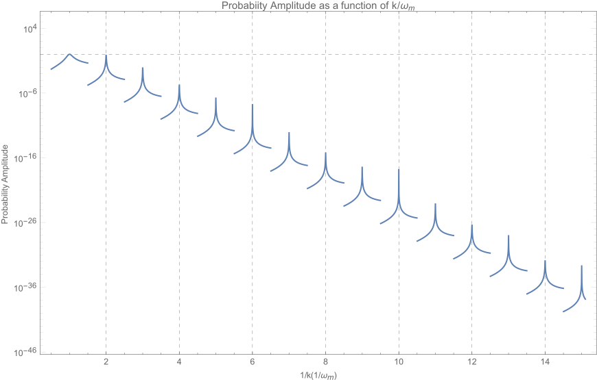
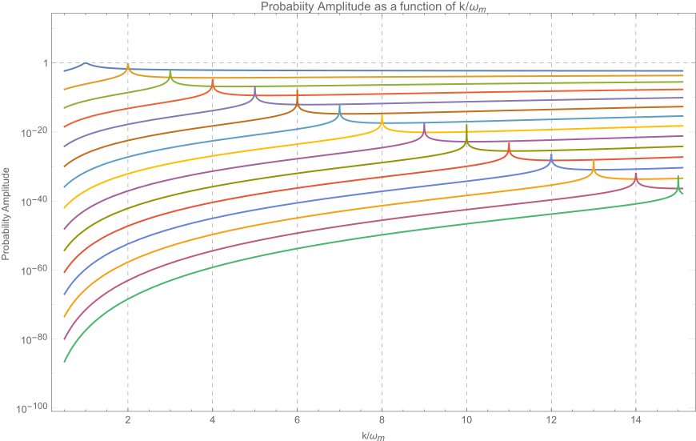
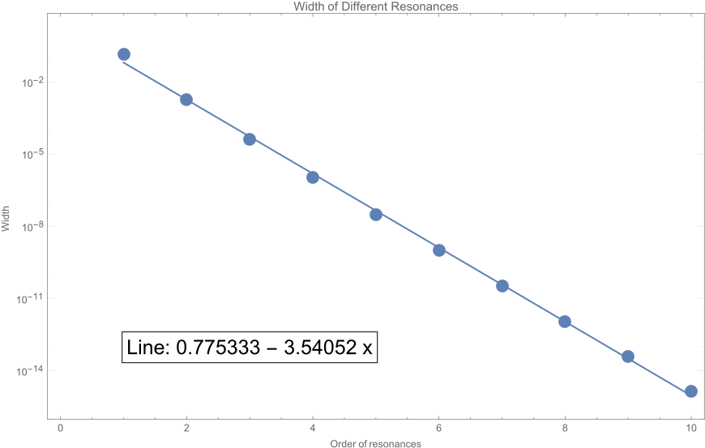

Matter Stimulated Oscillation
============================================

We investigate a system with matter potential

.. math::
   \lambda(x) = \lambda_0 + \delta \lambda (x),

where :math:`\lambda_0 = \sqrt{2}G_F n_{e0}` and :math:`\delta \lambda(x) = \sqrt{2}G_F \delta n_e(x)`.


The Hamiltonian is

.. math::
   H = - \frac{\omega_m}{2} \sigma_3 + \frac{\delta \lambda}{2} \cos 2\theta_m \sigma_3 - \frac{\delta \lambda}{2} \sin \theta_m \sigma_1.


.. admonition:: Derive the Hamiltonian
   :class: note

   This Hamiltonian can be derived easily using

   .. math::
      H = -\frac{\omega_m}{3}\sigma_3 + \frac{\delta \lambda}{2} U^\dagger \sigma_3 U.


A Unitary Transformation
-----------------------------


Suppose the wave function in this basis is written as

.. math::
   \begin{pmatrix} \psi_1 \\ \psi_2 \end{pmatrix}.

To remove the position dependent :math:`\sigma_3` term in the Hamiltonian which prevents us from solving the equation of motion easily, we use a new basis where the wave function is related to background matter basis through

.. math::
   \begin{pmatrix} \psi_1 \\ \psi_2 \end{pmatrix} = \begin{pmatrix} e^{-i \eta (x)} & 0 \\  0 & e^{-i \eta (x)}  \end{pmatrix} \begin{pmatrix} \psi_{b1} \\ \psi_{b2} \end{pmatrix}.


.. admonition:: Transformation of Pauli Matrices
   :class: note

   This transformation, defined as :math:`\mathbf{T}`, is unitary,

   .. math::
      \mathbf{T}^\dagger \mathbf{T} = \mathbf{I}.

   It doesn't change :math:`\sigma_3`.

   .. math::
      \mathbf{T} \sigma_3 \mathbf{T}^\dagger &= \sigma_3\\
      \mathbf{T}^\dagger \sigma_3 \mathbf{T} &= \sigma_3.

   It adds a phase to the off-diagonal elements of :math:`\sigma_1`,

   .. math::
      \mathbf{T} \sigma_1 \mathbf{T}^\dagger &= \begin{pmatrix} 0 & e^{-2i\eta} \\ e^{2 i\eta } & 0 \end{pmatrix} \\
      \mathbf{T}^\dagger \sigma_1 \mathbf{T} &= \begin{pmatrix} 0 & e^{2i\eta} \\ e^{-2 i\eta } & 0 \end{pmatrix}.


   We can also look at the following very general transformation.

   .. math::
      & \begin{pmatrix} e^{i\eta_1} & 0 \\ 0 & e^{-i\eta_1}\end{pmatrix} \begin{pmatrix} a_{11} & a_{12} \\ a_{21} & a_{22}\end{pmatrix}  \begin{pmatrix} e^{i\eta_2} & 0 \\ 0 & e^{-i\eta_2}\end{pmatrix} \\
      = & \begin{pmatrix} a_{11} e^{i(\eta_1+\eta_2)} & a_{12} e^{i(\eta_1 - \eta_2)} \\ a_{21} e^{-i(\eta_1-\eta_2)} & a_{22} e^{-i(\eta_1+\eta_2)}  \end{pmatrix}


The Schrodinger equation in background matter basis is

.. math::
   i\frac{d}{dx}\begin{pmatrix} \psi_{1} \\ \psi_2 \end{pmatrix} = \left(- \frac{\omega_m}{2} \sigma_3 + \frac{\delta \lambda}{2} \cos 2\theta_m \sigma_3 - \frac{\delta \lambda}{2} \sin \theta_m \sigma_1 \right) \begin{pmatrix} \psi_{1} \\ \psi_2 \end{pmatrix}

To write down the Schodinger equation in the new basis, we need the transformation of the Hamiltonian

.. math::
   \mathbf{T}^\dagger \cdot \mathrm{LHS} &= \mathbf{T}^\dagger\left[ i \begin{pmatrix} - i \frac{d\eta}{dx} e^{-i\eta} & 0 \\ 0 & i \frac{d\eta}{dx} e^{i\eta} \end{pmatrix} \begin{pmatrix} \psi_{b1} \\ \psi_{b2} \end{pmatrix} + i \begin{pmatrix}  e^{-i\eta} & 0 \\ 0  e^{i\eta} \end{pmatrix} \frac{d}{dx} \begin{pmatrix} \psi_1 \\ \psi_2 \end{pmatrix} \right] \\
   & =   i \begin{pmatrix} - i \frac{d\eta}{dx}  & 0 \\ 0 & i \frac{d\eta}{dx}  \end{pmatrix} \begin{pmatrix} \psi_{b1} \\ \psi_{b2} \end{pmatrix} + i \frac{d}{dx} \begin{pmatrix} \psi_1 \\ \psi_2 \end{pmatrix}  .


.. math::
   \mathbf{T}^\dagger \cdot \mathrm{RHS} &= \left[ -\frac{\omega_m}{2} \mathbf{T} ^\dagger \sigma_3 \mathbf{T} + \frac{\delta \lambda}{2} \cos 2\theta_m \mathbf{T}^\dagger \sigma_3 \mathbf{T} - \frac{\delta \lambda}{2} \sin 2\theta_m \mathbf{T}^\dagger \sigma_1 \mathbf{T}   \right] \begin{pmatrix} \psi_{b1} \\ \psi_{b2} \end{pmatrix} \\
   & =  \left[ -\frac{\omega_m}{2} \sigma_3  + \frac{\delta \lambda}{2} \cos 2\theta_m  \sigma_3  - \frac{\delta \lambda}{2} \sin 2\theta_m \begin{pmatrix} 0 & e^{2i\eta} \\ e^{-2 i\eta } & 0 \end{pmatrix}   \right] \begin{pmatrix} \psi_{b1} \\ \psi_{b2} \end{pmatrix} .


The equation of motion in this new basis becomes

.. math::
   \begin{pmatrix}  \frac{d\eta}{dx}  & 0 \\ 0 & - \frac{d\eta}{dx}  \end{pmatrix} \begin{pmatrix} \psi_{b1} \\ \psi_{b2} \end{pmatrix} + i \frac{d}{dx} \begin{pmatrix} \psi_1 \\ \psi_2 \end{pmatrix} =
   \left[ -\frac{\omega_m}{2} \sigma_3  + \frac{\delta \lambda}{2} \cos 2\theta_m  \sigma_3  - \frac{\delta \lambda}{2} \sin 2\theta_m \begin{pmatrix} 0 & e^{2i\eta} \\ e^{-2 i\eta } & 0 \end{pmatrix}   \right] \begin{pmatrix} \psi_{b1} \\ \psi_{b2} \end{pmatrix}

The key is to remove the :math:`\sigma_3` terms using this transformation, which requires

.. math::
   \begin{pmatrix}  \frac{d\eta}{dx}  & 0 \\ 0 & - \frac{d\eta}{dx}  \end{pmatrix} \begin{pmatrix} \psi_{b1} \\ \psi_{b2} \end{pmatrix} = \left[ -\frac{\omega_m}{2} \sigma_3  + \frac{\delta \lambda}{2} \cos 2\theta_m  \sigma_3 \right] \begin{pmatrix} \psi_{b1} \\ \psi_{b2} \end{pmatrix}.

It reduces to

.. math::
   \frac{d\eta(x)}{dx} = - \frac{\omega_m}{2} + \frac{\delta \lambda(x)}{2} \cos 2\theta_m ,

which has a general solution of the form

.. math::
   \eta(x) - \eta(0) = - \frac{\omega_m}{2} x + \frac{\cos 2\theta_m}{2} \int_0^x \delta\lambda (\tau) d\tau.
   :label: eta-x-general

We might choose :math:`\eta(0)=0`, which simplifies the relation

.. math::
   \eta(x)= - \frac{\omega_m}{2} x + \frac{\cos 2\theta_m}{2} \int_0^x \delta\lambda (\tau) d\tau.


.. admonition:: Other Initial Conditions
   :class: note

   The initial condition can be other convinient ones. For example we can remove the integration constant of the last term in the relation.

At any position/time, the wave function in background matter basis is

.. math::
   \begin{pmatrix} \psi_1 (x) \\ \psi_2(x)  \end{pmatrix} = \begin{pmatrix} e^{- i \eta} \psi_{b1} (x) \\ e^{i\eta} \psi_{b2} (x)  \end{pmatrix}.
   :label: wavefunction-diff-basis

To calculated the transition from low energy state to high energy state in background matter basis, with initial condition

.. math::
   \begin{pmatrix} \psi_1 (0) \\ \psi_2(0)  \end{pmatrix} = \begin{pmatrix} 1 \\ 0  \end{pmatrix},

we simply calculate

.. math::
   P_{1 \to 2} (x) = \lvert e^{i\eta} \psi_{b2} (x)  \rvert^2 = \lvert \psi_{b2} (x)  \rvert^2 .


Single Frequency Matter Perturbation
------------------------------------------------------------------


As a first step, we solve single frequency matter perturbation

.. math::
   \delta \lambda(x)  = A \sin (k x + \phi).


Using the relation between :math:`\eta` and :math:`\delta\lambda`, we solve out :math:`\eta`.

.. math::
   \eta(x) = - \frac{\omega_m}{2}x - \frac{\cos 2\theta_m}{2} \frac{A}{k} \cos (k x + \phi),

where we have chosen :math:`\eta(0)=-\frac{\cos 2\theta_m}{2}\frac{A}{k}\cos\phi`.

The problem is to solve the equation of motion

.. math::
   i \frac{d}{dx} \begin{pmatrix} \psi_{b1} \\ \psi_{b2} \end{pmatrix} = \frac{\sin 2\theta_m}{2}\delta\lambda(x) \begin{pmatrix} 0 &  e^{2i\eta(x)} \\   e^{-2i\eta(x)} &  0 \end{pmatrix}  \begin{pmatrix} \psi_{b1} \\ \psi_{b2} \end{pmatrix} .

We also define

.. math::
   h &= \frac{\sin 2\theta_m}{2}\delta\lambda(x)  e^{2i\eta(x)} \\
   & = \frac{\sin 2\theta_m}{2} A \sin (kx+\phi) e^{2i\left( -\frac{\omega_m}{2} x - \frac{A \cos 2\theta_m}{2k} \cos (kx+\phi) \right)}.
   :label: single-frequency-hamiltonian-element

Obviously, the exponential terms is too complicate. On the other hand, this equation of motion reminds us of the Rabi oscillation. So we decide to rewrite the exponential into some plane wave terms using Jacobi-Anger expansion. (Refs & Notes: Patton et al)

.. admonition:: Jacobi-Anger Expansion
   :class: note

   One of the forms of Jacobi-Anger expansion is

   .. math::
      e^{i z \cos (\Phi)} = \sum_{n=-\infty}^\infty i^n J_n(z) e^{i n\Phi}.
      :label: jacobi-anger-expansion


We define :math:`z_k = \frac{A}{k} \cos 2\theta_m`, with which we expand the term

.. math::
   e^{-i\frac{\cos 2\theta_m A}{k} \cos (kx +\phi)} = \sum_{n=-\infty}^\infty i^n J_n (-z_k) e^{in (kx +\phi)} =  \sum_{n=-\infty}^\infty (-i)^n J_n (z_k) e^{in (kx +\phi)},

where I used :math:`J_n(-z_k) = (-1)^n J_n(z_k)` for integer :math:`n`.

The expansion is plugged into the Hamiltonian elements,

.. math::
   h &= \frac{A \sin 2\theta_m \sin (kx + \phi)}{2} e^{-i\omega_m x } \sum_{n = - \infty}^\infty (-i)^n J_n(z_k) e^{i n ( kx + \phi)} \\
   & = \frac{A\sin 2\theta_m}{4i} \left( e^{i(kx + \phi)} - e^{-i(kx+\phi)} \right) e^{-i\omega_m x } \sum_{n = - \infty}^\infty (-i)^n J_n(z_k) e^{i n ( kx + \phi)} \\
   & = \frac{A\sin 2\theta_m}{4i} \left( \sum_{n=-\infty}^\infty e^{i(n+1)} i^n J_n (z_k) e^{i((n+1) k - \omega_m)x}  - \sum_{n'=-\infty}^\infty e^{i(n'-1)} (-i)^{n'}J_{n'}(z_k) e^{i( (n'-1)k - \omega_m)x}  \right)\\
   & = \frac{A\sin 2\theta_m}{4} \sum_{n=-\infty}^{\infty} e^{in\phi} \left( - (-i)^n \right) \frac{2n}{z_k} J_n (z_k) e^{i(nk-\omega_m)x},

where I have used

.. math::
   J_{n-1}(z_k) + J_{n+1}(z_k) = \frac{2n}{z_k} J_n(z_k).


Here comes the approximation. The most important oscillation we need is the one with largest period, which indicates the phase to be almost zero,

.. math::
   (n+1) k -\omega_m &\sim 0 \\
   (n'-1) k -\omega_m &\sim 0.
   :label: single-frequency-rwa-requirement


The two such conditions for the two summations are

.. math::
   n \equiv n_- &= \mathrm{Int}\left( \frac{\omega_m}{k} \right) - 1 \\
   n' \equiv n_+ &= \mathrm{Int}\left( \frac{\omega_m}{k} \right) + 1 .

We define :math:`\mathrm{Int}\left( \frac{\omega_m}{k} \right) = n_0`,

.. math::
   n_- &= n_0 - 1 \\
   n_+ &= n_0 + 1 .


The element of Hamiltonian is written as

.. math::
   h = - \frac{A\sin 2\theta_m}{2} e^{in_0\phi} (-i)^{n_0} \frac{n_0}{z_k} J_{n_0 }(z_k) e^{i(n_0 k -\omega_m)x}.


To save keystrokes, we define

.. math::
   F = - A\sin 2\theta_m e^{i n_0 \phi} (-i)^{n_0} \frac{n_0}{z_k} J_{n_0} (z_k) ,
   :label: definition-F

which depends on :math:`n_0` and :math:`z_k = \frac{A}{k} \cos 2\theta_m`. Notice that

.. math::
   \lvert F \rvert^2 = \left\lvert  k \tan 2\theta_m  n_0 J_{n_0} (z_k) \right\rvert^2 .


.. admonition:: Solving Using Mathematica
   :class: hint

   The Mathematica code::

      In[1]:= sys = I D[{phi1[x], phi2[x]}, x] == {{0, (g0R + I g0I) Exp[ I (-omegam + n0 k) x]}, {(g0R - I g0I) Exp[-I (-omegam + n0 k) x], 0}}.{phi1[x], phi2[x]}
      In[2]:= DSolve[sys, {phi1, phi2}, x]// FullSimplify
      Out[3]:= {{phi1 -> Function[{x},
      E^(1/2 I (k n0 + I Sqrt[-4 (g0I^2 + g0R^2) - (k n0 - omegam)^2] - omegam) x) C[1]
      + E^(1/2 (Sqrt[-4 (g0I^2 + g0R^2) - (k n0 - omegam)^2] + I (k n0 - omegam)) x) C[2]],
      phi2 -> Function[{x}, (1/(2 (g0I - I g0R)))
      I E^(-I (k n0 - omegam) x +
       1/2 I (k n0 + I Sqrt[-4 (g0I^2 + g0R^2) - (k n0 - omegam)^2] - omegam) x)
       (k n0 + I Sqrt[-4 (g0I^2 + g0R^2) - (k n0 - omegam)^2] - omegam) C[1]
       + (1/(2 (g0I - I g0R))) E^(1/2 (Sqrt[-4 (g0I^2 + g0R^2) - (k n0 - omegam)^2]
       + I (k n0 - omegam)) x - I (k n0 - omegam) x) (Sqrt[-4 (g0I^2 + g0R^2) - (k n0 - omegam)^2]
       + I (k n0 - omegam)) C[2]]}}


The general solution to the equation of motion is

.. math::
   \psi_{b1} = & C_1 e^{\frac{1}{2} i \left( n_0 k -\omega_m - \sqrt{  \lvert F \rvert^2 +  (n_0 k -\omega_m)^2 } \right)x} + C_2 e^{\frac{1}{2} i \left( n_0 k -\omega_m + \sqrt{  \lvert F \rvert^2 +  (n_0 k -\omega_m)^2 } \right)x} \\
   \psi_{b2} = & \frac{C_1}{F^*} i \left( n_0 k - \omega_m - \sqrt{ \lvert F\rvert^2 + ( n_0 k - \omega_m )^2 } \right) e^{ -\frac{1}{2}i (n_0 k - \omega_m ) x - \frac{1}{2} i \sqrt{ \lvert F \rvert^2 + (n_0 k - \omega_m )^2 }  } \\
   & + \frac{C_2}{F^*} i \left( n_0 k - \omega_m + \sqrt{ \lvert F\rvert^2 + ( n_0 k - \omega_m )^2 }  \right)   e^{ -\frac{1}{2}i (n_0 k - \omega_m ) x + \frac{1}{2} i \sqrt{ \lvert F \rvert^2 + (n_0 k - \omega_m )^2 }  } .

For simplicity, we define

.. math::
   g &= n_0 k  - \omega_m, \\
   q^2 &= \lvert F \rvert^2 + g^2.
   :label: definition-g-q


To determine the constants, we need intial condition,

.. math::
   \begin{pmatrix} \psi_1 (0) \\ \psi_2(0)  \end{pmatrix} = \begin{pmatrix} 1 \\ 0  \end{pmatrix} ,

which leads to

.. math::
   \begin{pmatrix} \psi_{b1} (0) \\ \psi_{b2}(0)  \end{pmatrix} = \begin{pmatrix} e^{i\eta(0)} \\ 0  \end{pmatrix},

using equation :eq:`wavefunction-diff-basis`.

Plug in the initial condition for the wave function,

.. math::
   C_1 + C_2 &= e^{i \frac{z_k}{2}\cos \phi} \\
   \frac{C_1}{2F^ * } i \left( g - q \right) + \frac{C _ 2}{ F ^ *} i \left( q + g  \right) & = 0.


The constants are solved out

.. math::
   C_1 &= e^{i \frac{z_k}{2}\cos \phi} \frac{q + g }{2 q} , \\
   C_2 &= e^{i \frac{z_k}{2}\cos \phi} \frac{ q - g }{2 q}.


where :math:`F` is defined in :eq:`definition-F` and :math:`l` and :math:`g` are defined in :eq:`definition-g-q`.


The second element of wave function becomes

.. math::
   \psi_{b2}(x) = \frac{- F}{ q } e^{i\frac{z_k}{2} \cos\phi} e^{- \frac{i}{2}gx} \sin \left( \frac{1}{2} q x \right).


The transition probability becomes

.. math::
   P_{1\to 2} = \lvert \psi_{b2} \rvert^2 = \frac{\lvert F \rvert^2}{q^2} \sin^2\left( \frac{ q }{2} x \right),

where :math:`q` is the oscillation wavenumber. Period of this oscillation is given by :math:`T = \frac{2\pi}{q}`.


.. admonition:: Compare The Result with Kneller et al
   :class: note

   Kneller et al have a transition probability

   .. math::
      \color{red}P_{12} = \frac{\kappa_n^2}{q_n^2} \sin^2 (q_n x),

   where :math:`\color{red}q_n^2 = k_n^2 + \kappa_n^2` and :math:`\color{red}2k_n = \tilde{\delta k}_{12} + n k_\star`.

   In my notation, :math:`k` is the same as their :math:`\color{red}k_\star`. After the first step of translation, we have :math:`g = \color{red} 2 k_n`.

   The definition of :math:`\color{red}\kappa_n` is given by

   .. math
      \color{red}\kappa_{ij,n} = (-i)^{n-1} \frac{n C_\star V_\star}{z_{ij}} J_n(z_{ij}) \tilde U_{ei}^* \tilde U_{ej} e^{i ( n \eta + z_{ij} \cos \eta)},

   in Kneller's notation and

   .. math::
      \delta V_{ee}(x) = C_\star V_\star \sin (k_\star x + \eta).

   So we conclude that my :math:`\lvert F \rvert ^2` is related to Kneller's :math:`\lvert \kappa_n \rvert^2` through

   .. math::
      \lvert F \rvert^2 = 4 \color{red} \lvert \kappa_n \rvert^2.

   We also have

   .. math::
      q^2 = \lvert F \rvert ^2 + g^2  = 4 \color{red} q_n^2,

   i.e., :math:`{\color{red}q_n} = \frac{ q }{2}`.

   Now we see the method we have used gives exactly the same transition probability as Kneller's.


To make the numerical calculations easier, we rewrite the result by defining the scaled variables

.. math::
   \hat k &= \frac{k}{\omega_m} \\
   \hat A & = \frac{A}{\omega_m} \\
   \hat g & = \frac{g}{\omega_m} = n_0 \hat k - 1,

so that :math:`n_0 = \mathrm{Round}\left( 1/\hat k\right)`, :math:`z_k=\frac{\hat A}{\hat k} \cos 2 \theta_m` and

.. math::
   P_{1\to 2} = \frac{\left\lvert \hat k \tan 2\theta_m n_0 J_{n_0} (z_k) \right\rvert^2}{\left\lvert  \hat k \tan 2\theta_m n_0 J_{n_0} (z_k) \right\rvert^2 + \hat g ^2}\sin^2\left( \frac{ q }{2} x \right) .


Physics Behind The Math
~~~~~~~~~~~~~~~~~~~~~~~~~~~~~~~~~~~~~


There are several question to answer before we can understand the picture of the math.

1. What does each term mean in the Hamiltonian?
2. What exactly is the unitary transformation we used to rotate the wave function?
3. What is the physical meaning of Jacobi-Anger expansion in our calculation?


To answer the first question, we need to write down the solution to Schrodinger equation assuming the Hamiltonian has only one term. The results are listed below.

============================================================ =================================================================================================================================
Hamiltonian                                                       Solution to The First Element of Wave Function
============================================================ =================================================================================================================================
.. math:: -\frac{\omega_m}{2}\sigma_3                           .. math:: \psi_1 \sim e^{i\omega_m x/2}
.. math:: \frac{\delta\lambda}{2}\cos 2\theta_m \sigma_3        .. math:: \psi_1 \sim e^{i\frac{A\cos 2\theta_m}{2k}\cos(kx+\phi)}
.. math:: \frac{\delta\lambda}{2}\cos 2\theta_m \sigma_3        .. math:: \psi_1 = C_1 e^{i\frac{A\sin 2\theta_m}{2k}\cos(kx+\phi)} + C_2 e^{-i\frac{A\sin 2\theta_m}{2k}\cos(kx+\phi)}
============================================================ =================================================================================================================================


The unitary transformation used is to move our reference frame to a co-rotating one. :math:`-\frac{\omega_m}{2}\sigma_3` is indeed causing the wave function to rotate and removing this term using a transformation means we are co-rotating with it. :math:`\frac{\delta\lambda}{2}\cos 2\theta_m \sigma_3` causes a more complicated rotation however it is still a rotation.


As for Jacobi-Anger expansion, it expands an oscillating matter profile to infinite constant matter potentials. To see it more clearly, we assume that :math:`\delta\lambda= \lambda_c` is constant. After the unitary transformation, the effective Hamiltonian is

.. math::
   H' = \frac{\sin 2\theta_m}{2} \lambda_c \begin{pmatrix} 0 & e^{2i\eta(x)} \\ e^{-2i\eta(x)} & 0 \end{pmatrix},

where :math:`\eta(x) = -\frac{\omega_m}{2}x + \frac{\cos 2\theta_m}{2}\lambda_c x` and we have chosen :math:`\eta(0)=0`.

The 12 element of the Hamiltonian becomes

.. math::
   \frac{\sin 2\theta_m}{2} \lambda_c e^{2i\eta(x)} = \frac{\sin 2\theta_m}{2} \lambda_c e^{2i\left( \frac{\omega_m}{2} + \frac{\cos 2\theta_m}{2} \lambda_c \right)x} .

The significance of it is to show that a constant matter profile will result in a simple exponential term. However, as we move on to periodic matter profile, we have a Hamiltonian element of the form

.. math::
   h = \frac{\sin 2\theta_m}{2} A \sin (kx+\phi) e^{2i\left( -\frac{\omega_m}{2} x + \frac{A \cos 2\theta_m}{2k} \cos (kx+\phi) \right)},

as derived in equation :eq:`single-frequency-hamiltonian-element`. To compare with the constant matter case, we make a table of relevant terms in Hamiltonian.

================================================================================   ========================================================================
Constant Matter Profile :math:`\delta\lambda = \lambda_c`                           Period Matter Profile :math:`\delta\lambda=A\sin (kx+\phi)`
================================================================================   ========================================================================
.. math:: \frac{\sin 2\theta_m}{2}\lambda_c e^{i \cos 2\theta_m \lambda_c x}         .. math:: \frac{A\sin 2\theta_m}{4} \sum_{n=-\infty}^{\infty} e^{in\phi} \left( - i^n \right) \frac{2n+1}{z_k} J_n (z_k) e^{i(nk-\omega_m)x}
================================================================================   ========================================================================

The periodic profile comes into the exponential. Jacobi-Anger expansion (equation :eq:`jacobi-anger-expansion`) expands the periodic matter profile into infinite constant matter profiles. By comparing the two cases, we conclude that :math:`\cos 2\theta_m\lambda_c` corresponds to :math:`nk`.

The RWA approximation we used to drop fast oscillatory terms in the summation is to find the most relevant constant matter profile per se.

The big question is which constant matter profiles are the most important ones? Mathematically, we require the phase to be almost zero, i.e. equation :eq:`single-frequency-rwa-requirement` or

.. math::
   n_0 k - \omega_m \sim 0 ,

where :math:`n_0=\mathrm{Round}\left( \frac{\omega_m}{k} \right)`.


**What is the meaning of this condition in this new basis?** If we define a effective matter density out of the Jacobi-Anger expanded series, we should define it to be

.. math::
   \lambda_c' = \frac{n_0 k}{\cos 2\theta_m}.

Then we can rewrite the RWA requirement as

.. math::
   \lambda_c' - \cos 2\theta_m \omega_m = 0.


.. admonition:: A Reminder of MSW Resonance
   :class: note

   The MSW Hamiltonian in flavor basis is

   .. math::
      \mathbf H = \frac{\omega_v}{2}( -\cos2\theta_v \sigma_3 + \sin 2\theta_v \sigma_1 )   {\color{red} + \frac{\lambda}{2} \mathbf {\sigma_3}}  {\color{green}+ \Delta \mathbf I},

   where the MSW resonance happens when all the :math:`\sigma_3` terms cancel eath other, i.e.,

   .. math::
      - \omega_v \cos 2\theta_v  + \lambda = 0.


The Resonances
~~~~~~~~~~~~~~~~~~~~~~~~~~~~~~~~~


.. admonition:: Questions
   :class: question

   There are several questions to be answered.

   1. How good is the RWA approximation? What are the conditions?
   2. What can we use for other calculations?
   3. Multiple matter frequency?




   Probabiity Amplitude as a function of :math:`k/\omega_m` within RWA, with parameters :math:`A=0.1, \theta_m=\pi/5, \phi=0`.




   Probabiity Amplitude as a function of :math:`k/\omega_m` for each term in Jacobi-Anger expansion, with parameters :math:`A=0.1, \theta_m=\pi/5, \phi=0`.


To look at the resonances I define a Mathematica function to calculate the FWHM.


.. admonition:: Find FWHM Using Mathematica
   :class: hint

   The Mathematica code::

      fwhm[n_] := First@Differences[k /. {ToRules@Reduce[amplitude[k, 0.1, Pi/5, n] == 0.5 &&k > (1 - 0.5/Exp[n]/n^2)/n && k < (1 + 0.5/Exp[n]/n^2)/n, k]}]




   Width of the resonances for :math:`A=0.1, \theta_m=\pi/5, \phi=0`.


How do we understand the resonance? Resonance width of each order of resonance (each n) should be calculated analytically.

.. admonition:: Lorentzian Distribution
   :class: hint

   Three-parameter Lorentzian function is

   .. math::
      f_{x_0,\sigma,A}(x)= \frac{1}{\pi} \frac{\sigma}{\sigma^2 + (x-x_0)^2},

   which has a width :math:`2\gamma`.

To find the exact width is hopeless since we need to inverse Bessel functions. Nonethless, we can assume that the resonance is very narrow so that :math:`\left\lvert F \right\rvert^2` doesn't change a lot. With the assumption, the FWHM is found be setting the amplitude to half, which is

.. math::
   \Gamma = \left\lvert \frac{2\hat F}{n_0} \right\rvert = \left\lvert 2 \tan 2\theta_m \frac{J_{n_0}(z_k)}{n_0} \right\rvert  .

To verify this result, we compare it with the width found numerically from the exact amplitude.


.. figure:: assets/matter-stimulated/stimulated-single-frequency-width-approximation-amp-point1.png
   :align: center

   Comparison of approximated width and numerical results for perturbation amplitude :math:`\hat A = \frac{A}{\omega_m} = 0.1`.


.. figure:: assets/matter-stimulated/stimulated-single-frequency-width-approximation-amp-1.png
   :align: center

   Comparison of approximated width and numerical results for perturbation amplitude :math:`\hat A = \frac{A}{\omega_m} = 1`.


Perturbation Amplitude and Transition Probability
~~~~~~~~~~~~~~~~~~~~~~~~~~~~~~~~~~~~~~~~~~~~~~~~~~~~~~~~~~~~~~~~~~~~~~~~~~~~~~~~~~~~


.. figure:: assets/matter-stimulated/pltPertAmpPertWaveNumTransitionAmp.svg
   :align: center

   Transition probability amplitude at different perturbation amplitude and perturbation wavenumber.


Multi-frequency Matter Perturbation
------------------------------------------------------------------


However, as we proceed to the more realistic matter profile, multi-frequency matter profiles are necessary. Generally, we choose the perturbation matter profile upon a constant background to be

.. math::
   \delta \lambda(x) = \sum_n A_n \sin (k_n x + \phi_n).

Using :eq:`eta-x-general` we conclude that

.. math::
   \eta(x) = - \frac{\omega_m}{2}x - \frac{\cos 2\theta_m}{2} \sum_n \frac{A_n}{k_n} \cos ( k_n x+ \phi_n ).

Hence we write down

.. math::
   h = \frac{\sin 2\theta_m}{2} \sum_a A_a \sin (k_a x + \phi_a) e^{-i\omega_m x}\prod_{a} \sum_{n=-\infty}^{\infty} (-i)^n J_n (z_{k_a}) e^{i n(k_a x + \phi_a) }


Two Frequencies
~~~~~~~~~~~~~~~~~~~~~~~~~~~~~~~


To work out the equation of motion that we could solve, we deal with two frequencies first,

.. math::
   \delta \lambda ( x ) = A_1\sin (k_1 x + \phi_1) + A_2 \sin (k_2 x + \phi_2),

while

.. math::
   h = \frac{\sin 2\theta_m}{2} \sum_{a = 1}^2 A_a \sin (k_a x + \phi_a) e^{-i\omega_m x}\prod_{a=1}^2 \sum_{n=-\infty}^{\infty} (-i)^n J_n (z_{k_a}) e^{i n(k_a x + \phi_a) }.


Rewrite Multiplication into Summation
`````````````````````````````````````````````````````````


.. admonition:: Summation Algebra
   :class: note

   A multiplication of two summations

   .. math::
      \sum_n a_n \sum_m b_m  = \sum_{N = -\infty}^{\infty} \sum_{m+n=N} a_n b_m = \sum_{N=-\infty}^\infty \sum_{n=-\infty}^{N} a_n b_{N-n}.
      :label: multiplication-summation-rule

   The rule is to sum over a line :math:`m+n=N` then sum over :math:`N`.


   .. figure:: assets/matter-stimulated/summation-algebra.svg
      :align: center

      Rewrite multiplication of summations into summations only.


The multiplication becomes

.. math::
   h &= \frac{\sin 2\theta_m}{2} \sum_{a = 1}^2 A_a \sin (k_a x + \phi_a) e^{-i\omega_m x} \sum_{N=-\infty}^{\infty} \sum_{n=-\infty}^{N} (-i)^n J_n (z_{k_1}) e^{i n(k_1 x + \phi_1) } (-i)^{N-n} J_{N-n}(z_{k_2}) e^{i (N-n)(k_2 x + \phi_2)} \\
   &=\frac{\sin 2\theta_m}{2} \sum_{a = 1}^2 A_a \sin (k_a x + \phi_a) e^{-i\omega_m x} \sum_{N=-\infty}^{\infty} \sum_{n=-\infty}^{N} (-i)^N J_{n}(z_{k_1}) J_{N-n}(z_{k_2}) e^{i n ((k_1-k_2)x + \phi_1 - \phi_2) + i N (k_2 x + \phi_2)}


To proceed on, we rewrite :math:`\sum_{a = 1}^2 A_a \sin (k_a x + \phi_a)`,

.. math::
   &A_1 \sin(k_1 x +\phi_1) + A_2 \sin(k_2 x +\phi_2) \\
   = & \frac{A_1}{2i}\left( e^{i(k_1 x + \phi_1)} +  e^{-i(k_1 x + \phi_1)} \right) + \frac{A_2}{2i} \left( e^{i(k_2 x + \phi_2)} +  e^{-i(k_2 x + \phi_2)} \right).

We define

.. math::
   h = h_1 + h_2,

where

.. math::
   h_1 =& \frac{A_1\sin 2\theta_m}{4i}\bigg( \sum_{N=-\infty}^\infty \sum_{n=-\infty}^N (-i)^N J_n(z_{k_1}) J_{N-n}(z_{k_2}) e^{ i  \left(  (n+1) (k_1 x + \phi_1) +  (N-n)(k_2 x + \phi_2) - \omega_m x \right) } \\
   & \sum_{N=-\infty}^\infty \sum_{n=-\infty}^N (-i)^N J_n(z_{k_1}) J_{N-n}(z_{k_2}) e^{ i \left(  (n-1) (k_1 x + \phi_1) + (N-n)(k_2 x + \phi_2) -  \omega_m x \right) }  \bigg),

and

.. math::
   h_2=& \frac{A_2\sin 2\theta_m}{4i}\bigg( \sum_{N=-\infty}^\infty \sum_{n=-\infty}^N (-i)^N J_n(z_{k_1}) J_{N-n}(z_{k_2}) e^{ i  \left(  n (k_1 x + \phi_1) + (N-n+1)(k_2 x + \phi_2) -  \omega_m x \right) } \\
   & \sum_{N=-\infty}^\infty \sum_{n=-\infty}^N (-i)^N J_n(z_{k_1}) J_{N-n}(z_{k_2}) e^{ i  \left(  n (k_1 x + \phi_1) + (N-n-1)(k_2 x + \phi_2) -  \omega_m x \right) }  \bigg).


To adopt the RWA approximation, we require some integers for each summation to satisfy the relations

.. math::
   (n_{11,N} + 1)k_1 + (N-n_{11,N}) k_2 -\omega_m &\sim 0 \\
   (n_{12,N} - 1)k_1 + (N-n_{12,N}) k_2 -\omega_m &\sim 0 \\
   n_{21,N}k_1 + (N-n_{21,N}+1) k_2 -\omega_m &\sim 0 \\
   n_{22,N} k_1 + (N-n_{22,N}-1) k_2 -\omega_m &\sim 0.

so that the :math:`x` dependent exponential almost vanishes (obtain the largest wavelength in fact). Notice that each :math:`n_{ij,N}` depends on the summation index :math:`N`.

We solve each :math:`n_{ij,N}`,

.. math::
   n_{11,N} &\sim \mathrm{Round}\left[\frac{\omega_m - N k_2 -k_1}{k_1 - k_2} \right] \\
   n_{12,N} &\sim \mathrm{Round}\left[\frac{\omega_m - N k_2 + k_1}{k_1 - k_2}\right] \\
   n_{21,N} &\sim \mathrm{Round}\left[\frac{\omega_m - (N + 1) k_2 }{k_1 - k_2} \right]\\
   n_{22,N} &\sim \mathrm{Round}\left[\frac{\omega_m - (N - 1) k_2 }{k_1 - k_2} \right].


Another important constrain is that :math:`n\leq N`, thus we have

.. math::
   N_{11} &\sim \mathrm{Round}\left[\frac{\omega_m - k_1}{k_1}\right] \\
   N_{12} &\sim \mathrm{Round}\left[\frac{\omega_m + k_1}{k_1}\right] \\
   N_{21} &\sim \mathrm{Round}\left[\frac{\omega_m - k_2}{k_1}\right] \\
   N_{22} &\sim \mathrm{Round}\left[\frac{\omega_m + k_2}{k_1}\right],


for each summation over :math:`N` and we require :math:`N\geq N_{ij}` for each summation. We also assumed :math:`k_1 > k_2`. In other words, :math:`N_{ij}` are the lower limits of the summations over :math:`N`'s.


Using RWA, we keep only the resonance terms for the summation over :math:`n`'s,

.. math::
   h_1 \approx & \frac{A_1\sin 2\theta_m}{4i} \bigg( \sum_{N=N_{11}}^\infty (-i)^N J_{n_{11}} (z_{k_1}) J_{N-n_{11}}(z_{k_2}) e^{ i \left(  (n_{11}+1) (k_1 x + \phi_1) + (N-n_{11})(k_2 x + \phi_2) - \omega_m x \right) }   \\
   & \sum_{N=N_{12}}^\infty (-i)^N J_{n_{12}} (z_{k_1}) J_{N-n_{12}}(z_{k_2}) e^{ i \left(  (n_{12}-1) (k_1 x + \phi_1) + (N-n_{12})(k_2 x + \phi_2) - \omega_m x \right) }\bigg),


and

.. math::
   h_2 \approx & \frac{A_2\sin 2\theta_m}{4i} \bigg( \sum_{N=N_{21}}^\infty (-i)^N J_{n_{21}} (z_{k_1}) J_{N-n_{21}}(z_{k_2}) e^{ i \left(  n_{21} (k_1 x + \phi_1) + (N-n_{21} + 1)(k_2 x + \phi_2) - \omega_m x \right) }   \\
   & \sum_{N=N_{22}}^\infty (-i)^N J_{n_{22}} (z_{k_1}) J_{N-n_{22}}(z_{k_2}) e^{ i \left(  n_{22} (k_1 x + \phi_1) + (N-n_{22}-1)(k_2 x + \phi_2) - \omega_m x \right) }\bigg) .


.. admonition:: Comment on This Result
   :class: hint

   I can imagine how hard it is to solve the equation of motion with this :math:`h`. Well, is it?


One by One Approximation
`````````````````````````````````````

After reading Kelly Patton et al, we decided to try the approximation they are using.

By looking at the Hamiltonian, we can identify terms like this

.. math::
   h_a = \left( \frac{\sin 2\theta_m}{2}  A_a \sin (k_a x + \phi_a) e^{-i\omega_m x}  \sum_{n=-\infty}^{\infty} (-i)^n J_n (z_{k_a}) e^{i n(k_a x + \phi_a) }  \right) \prod_{b\neq a} \sum_{n=-\infty}^{\infty} (-i)^n J_n (z_{k_b}) e^{i n(k_b x + \phi_b) },

where the parenthensis part is what we would have if only one frequency is used and we also have

.. math::
   h = \sum_{a} h_a,

for all frequencies.

This reminds us that each of these terms means the interference due to other frequencies. As a simple example, we demonstrate two-frequency case.

The two-frequency matter perturbation system has a Hamiltonian element :math:`H_{12}`

.. math::
   h = h_1 + h_2,

where

.. math::
   h_1 & = {\color{blue}-\frac{k_1 \tan 2\theta_m}{2} \sum_{n_1=-\infty}^{\infty} (-i)^{n_1} n_1 J_{n_1} (z_{k_1}) e^{i (n_1 k_1-\omega_m)x} e^{i n_1\phi_1} } {\color{red} \sum_{n_2=-\infty}^{\infty} (-i)^{n_2} J_{n_2}(z_{k_2}) e^{i(n_2k_2)x} e^{i n_2 \phi_2}  }, \\
   h_2 & = {\color{red} - \frac{k_2\tan 2\theta_m}{2} \sum_{n_2=-\infty}^{\infty} (-i)^{n_2} n_2 J_{n_2}(z_{k_2}) e^{i(n_2k_2-\omega_m)x} e^{i n_2 \phi_2}  }{\color{blue} \sum_{n_1=-\infty}^{\infty} (-i)^{n_1} J_{n_1}(z_{k_1}) e^{in_1 k_1 x} e^{i n_1 \phi_1} }

with red color coding the second frequency and blue coding the first frequency. :math:`h` is symmetric under exchange of index 1, 2 since the exchange simply switches :math:`h_1` and :math:`h_2`.


Which one Dominates?
~~~~~~~~~~~~~~~~~~~~~~~~~~~~~~~~~~~~~~~~~~~~~~~~~~~~~~~~~~


To grasp a clue, we need to identify which term in the summation dominates. Without a good analytical analysis, the only way to do is to numerically calculate the effect of each order.

By order, we are already thinking of a dominating term which is not true. Nonethless, we assume RWA can be applied to the part that looks like one frequency only. In our two-frequency example, first RWA leads to

.. math::
   h_1 & \approx {\color{blue}-\frac{k_1 \tan 2\theta_m}{2} (-i)^{n_{1,0}} n_{1,0} J_{n_{1,0}} (z_{k_1}) e^{i (n_{1,0} k_1-\omega_m)x} e^{i n_{1,0}\phi_1} } {\color{red} \sum_{n_2=-\infty}^{\infty} (-i)^{n_2} J_{n_2}(z_{k_2}) e^{i(n_2k_2)x} e^{i n_2 \phi_2}  }, \\
   h_2 & \approx {\color{red} - \frac{k_2\tan 2\theta_m}{2} (-i)^{n_{2,0}} n_{2,0} J_{n_{2,0}}(z_{k_2}) e^{i(n_{2,0}k_2-\omega_m)x} e^{i n_{2,0} \phi_2}  }{\color{blue} \sum_{n_1=-\infty}^{\infty} (-i)^{n_1} J_{n_1}(z_{k_1}) e^{in_1 k_1 x} e^{i n_1 \phi_1} },
   :label: eqn-after-first-rwa

where

.. math::
   n_{1,0} &= \mathrm{Round}\left[  \frac{\omega_m}{k_1}  \right], \\
   n_{2,0} &= \mathrm{Round}\left[  \frac{\omega_m}{k_2}  \right] .

With this approximation, we can use RWA again by requiring

.. math::
   (n_{1,0} k_1-\omega_m + n_2 k_2)x &\sim 0, \\
   (n_1 k_1-\omega_m + n_{2,0} k_2)x &\sim 0,

where the integer solutions are

.. math::
   n'_{2,0} &= \mathrm{Round}\left[ \frac{ n_{1,0} k_1-\omega_m }{k_2} \right], \\
   n'_{1,0} &= \mathrm{Round}\left[ \frac{ n_{2,0} k_1-\omega_m }{k_1} \right].

Now we can remove all the summations using another RWA approximation. However, whether it holds is up to investigation.

The final result is

.. math::
   h_1 & \approx {\color{blue}-\frac{k_1 \tan 2\theta_m}{2} (-i)^{n_{1,0}} n_{1,0} J_{n_{1,0}} (z_{k_1}) e^{i (n_{1,0} k_1-\omega_m)x} e^{i n_{1,0}\phi_1} } {\color{red} (-i)^{n'_{2,0}} J_{n'_{2,0}}(z_{k_2}) e^{i(n'_{2,0}k_2)x} e^{i n'_{2,0} \phi_2}  } \\
   & = -\frac{k_1 \tan 2\theta_m}{2} (-i)^{ n_{1,0}+n'_{2,0} }   e^{i (n_{1,0}\phi_1 + n'_{2,0} \phi_2)} n_{1,0} J_{n_{1,0}} (z_{k_1})  J_{n'_{2,0}}(z_{k_2}) e^{i(n_{1,0} k_1-\omega_m + n'_{2,0}k_2)x}  \\
   & \equiv \frac{F_1}{2} e^{i(n_{1,0} k_1-\omega_m + n'_{2,0}k_2)x}  , \\
   h_2 & \approx {\color{red} - \frac{k_2\tan 2\theta_m}{2} (-i)^{n_{2,0}} n_{2,0} J_{n_{2,0}}(z_{k_2}) e^{i(n_{2,0}k_2-\omega_m)x} e^{i n_{2,0} \phi_2}  }{\color{blue} \sum_{n_1=-\infty}^{\infty} (-i)^{n_1} J_{n_1}(z_{k_1}) e^{in_1 k_1 x} e^{i n_1 \phi_1} } \\
   & = - \frac{k_2\tan 2\theta_m}{2} (-i)^{n_{2,0}+ n'_{1,0} }   e^{i (n_{2,0} \phi_2 + n'_{1,0} \phi_1)}  n_{2,0} J_{n_{2,0}}(z_{k_2}) J_{n'_{1,0}}(z_{k_1})  e^{i(n_{2,0}k_2-\omega_m+ n'_{1,0} k_1)x} \\
   & \equiv \frac{F_2}{2} e^{i(n_{2,0}k_2-\omega_m+ n'_{1,0} k_1)x} .


We are not sure whether lowest order is sufficient, so higher orders should be examined.

.. admonition:: How to Include Higher Orders
   :class: notes

   The first thought of higher orders is to add more from the summation before the last RWA. However, it is highly suspicious that this is just like the one frequency case which has a very fast drop in the resonance width as we go to higher orders.


Here we always keep the RWA condition for the last RWA process. What can be changed is the first assumption that the most important term is when only one frequency is relavent which is not always true. We now consider :math:`n_{i,\pm 1}=n_{i,0}\pm 1` and :math:`n'_{i,\pm 1} =  \mathrm{Round}\left[ \frac{ n_{j,\pm 1} k_j - \omega_m }{k_i} \right]` with :math:`j\neq i`, thus we replace :math:`n_{i,0}` with :math:`n_{i,\pm 1}` to get higher order corrections.


.. figure:: assets/matter-stimulated/compApproxNum/compApproxNum.png
   :align: center

   Top Left: Smaller wavenumber :math:`k_1=0.95` is at resonance and it has smaller perturbation amplitude (:math:`k_2=1.55`);
   Top Right: Smaller wavenumber :math:`k_1=0.95` is at resonance and it has larger perturbation amplitude (:math:`k_2=1.55`);
   Bottom Left: Larger wavenumber :math:`k_2=0.95` is at resonance and it has smaller perturbation amplitude (:math:`k_1=0.35`);
   Bottom Right: Larger wavenumber :math:`k_2=0.95` is at resonance and it has larger perturbation amplitude (:math:`k_1=0.35`).
   Red dotted line is numerical solution, black line is lowest approximation of :math:`k_2`, magenta is higher order approximation of :math:`k_2`.


In real physical systems, it is more likely to have a matter profile so that we have the bottom left situation. In other words, RWA method breaks down in the most interesting case.


Fix RWA in 2-frequency Case
~~~~~~~~~~~~~~~~~~~~~~~~~~~~~~~~~~~


To fix this problem, we could add more higher orders, however, through the demonstration of the four cases, it is very unlikely that adding the third or even fourth order will help.

Then we ask the question, which approximation breaking down exactly? To find out, we first include all the orders after the first assumption, i.e., we do not use RWA for the second time, which means :eq:`eqn-after-first-rwa` holds but no RWA will be applied to this.

Not notice that the summation in :eq:`eqn-after-first-rwa` is due to the Jacobi-Anger expansion, which is not even helpful in our next calculation. Therefore, we trace back to their original expressions, which leads to

.. math::
   h_1 & \approx {\color{blue}-\frac{k_1 \tan 2\theta_m}{2} (-i)^{n_{1,0}} n_{1,0} J_{n_{1,0}} (z_{k_1}) e^{i (n_{1,0} k_1-\omega_m)x} e^{i n_{1,0}\phi_1} } {\color{red} e^{-i z_{k_2} \cos(k_2 x+\phi_2)  } }, \\
   h_2 & \approx {\color{red} - \frac{k_2\tan 2\theta_m}{2} (-i)^{n_{2,0}} n_{2,0} J_{n_{2,0}}(z_{k_2}) e^{i(n_{2,0}k_2-\omega_m)x} e^{i n_{2,0} \phi_2}  }{\color{blue}  e^{-i z_{k_1} \cos(k_1 x+\phi_1)  } }.

We then perform a numerical calculation using this Hamiltonian element and compare it with the full numerical results.


A More Systematic Thinking of 2-Frequency
~~~~~~~~~~~~~~~~~~~~~~~~~~~~~~~~~~~~~~~~~~~~~~~~~


The 12 element can be written as

.. math::
   h = h_1 + h_2,

where

.. math::
   h_1 &=\sum_{n_1=-\infty}^\infty \sum_{n_2=-\infty}^{\infty}\left( -(-i)^{n_1+n_2}\frac{\tan 2\theta_m}{2} n_1 k_1 J_{n_1}(z_{k_1}) J_{n_2}(z_{k_2})  \right) e^{i(n_1\phi_1+n_2\phi_2)} e^{i(n_1 k_1 + n_2 k_2 - \omega_m)x}, \\
   h_2 &=\sum_{n_1=-\infty}^\infty \sum_{n_2=-\infty}^{\infty}\left( -(-i)^{n_1+n_2}\frac{\tan 2\theta_m}{2} n_2 k_2 J_{n_1}(z_{k_1}) J_{n_2}(z_{k_2})  \right) e^{i(n_1\phi_1+n_2\phi_2)} e^{i(n_1 k_1 + n_2 k_2 - \omega_m)x}.

For simplicity, we define

.. math::
   B_{n_1,n_2}(k_1,k_2) &= -(-i)^{n_1+n_2}\frac{\tan 2\theta_m}{2} n_1 k_1 J_{n_1}(z_{k_1}) J_{n_2}(z_{k_2}) ,\\
   \Phi & = e^{i(n_1\phi_1+n_2\phi_2)}.

Notice that

.. math::
   B_{n_2,n_1}(k_2,k_1) &= -(-i)^{n_1+n_2}\frac{\tan 2\theta_m}{2} n_2 k_2 J_{n_1}(z_{k_1}) J_{n_2}(z_{k_2}).

Using these definitions, we rewrite the Hamiltonian 12 element

.. math::
   h &= h_1 + h_2 \\
   & = \sum_{n_1=-\infty}^\infty \sum_{n_2=-\infty}^{\infty} B_{n_1,n_2}(k_1,k_2) \Phi e^{i(n_1 k_1 + n_2 k_2 - \omega_m)x} +  \sum_{n_1=-\infty}^\infty \sum_{n_2=-\infty}^{\infty} B_{n_2,n_1}(k_2,k_1) \Phi e^{i(n_1 k_1 + n_2 k_2 - \omega_m)x} \\
   & = \sum_{n_1=-\infty}^\infty \sum_{n_2=-\infty}^{\infty} \left( B_{n_1,n_2}(k_1,k_2) + B_{n_2,n_1}(k_2,k_1) \right) \Phi e^{i(n_1 k_1 + n_2 k_2 - \omega_m)x},

where :math:`B\equiv B_{n_1,n_2}(k_1,k_2) + B_{n_2,n_1}(k_2,k_1)` is what we are interested in.


3 Frequencies
~~~~~~~~~~~~~~~~~~~~~~~~~~~~~~~~~~~~~~~~~~~~


To extend what we have done to more frequencies is easy. For 3 frequencies, the 12 element of Hamiltonian has such a pattern that

.. math::
   h &= {\color{blue} \delta \lambda_1 \sum_{n_1} \cdots } {\color{red} \sum_{n_2} \cdots } {\color{cyan}\sum_{n_3} \cdots } + {\color{blue}\sum_{n_1} \cdots } {\color{red} \delta \lambda_2 \sum_{n_2} \cdots } {\color{cyan}\sum_{n_3} \cdots } + {\color{blue}\sum_{n_1} \cdots } {\color{red}  \sum_{n_2} \cdots } {\color{cyan} \delta \lambda_3 \sum_{n_3} \cdots } \\
   & \equiv h_1 + h_2 + h_3.

As what we have tried in 2-frequency case, these terms can be viewed as three terms each is the interference between one frequency and the other two.

First of all, we assume the most important terms for :math:`h_1,h_2,h_3` are determined by the :math:`k_1,k_2,k_3` alone resonance respectively. Then we need to explore which terms to keep in the other two summations. Since the other two summations in each term are symmetric, we would like to include the resonance condition for one of them.

As an example, the first assumption leads to

.. math::
   h_1 \approx {\color{blue} \delta \lambda_1 \cdots(with n_{1,0} in it) } {\color{red} \sum_{n_2} \cdots } {\color{cyan}\sum_{n_3} \cdots }.

Then we include the other resonances

.. math::
   (to do)


.. admonition:: To do
   :class: todo

   1. Find the resonance of single frequency  F^2/(F^2+g^2) we can use expansion
   2. Numerical determine the width of single frequency
   3. h_1=n1 k1+n2 k2; h_1=(n1\pm 1)k1+n2 k2 ;
   4. Numerical solution to the complete problem without approximation.


Refs & Notes
------------------------

1. Patton, K. M., Kneller, J. P., & McLaughlin, G. C. (2014). Stimulated neutrino transformation through turbulence. Physical Review D, 89(7), 073022. doi:10.1103/PhysRevD.89.073022
2. Kneller, J. P., McLaughlin, G. C., & Patton, K. M. (2013). Stimulated neutrino transformation in supernovae. AIP Conference Proceedings, 1560, 176–178. doi:10.1063/1.4826746
